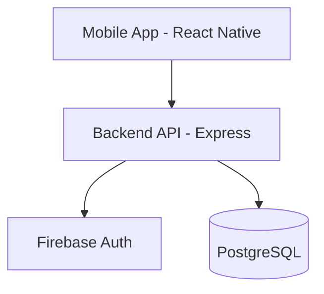

# Sakank

Sakank is a purpose-built, mobile-first marketplace designed to solve a localized, highly painful problem: university student accommodation in Egypt. It creates a trusted, verified ecosystem connecting students with property owners, focusing relentlessly on safety, transparency, and the specific needs of the academic calendar.

## Quick Links
- [Onboarding Guide](./docs/onboarding.md)
- [First Day Guide](./docs/FIRST_DAY.md)
- [Project Roadmap](./docs/project-roadmap.md)
- [API Guidelines](./docs/api-guidelines.md)
- [Database ERD](./docs/database/erd.md)
- [Contributing Rules](./CONTRIBUTING.md)

## Tech Stack
- **Monorepo:** Turborepo, pnpm workspaces
- **Backend:** Node.js, Express, TypeScript, Prisma, PostgreSQL
- **Mobile:** React Native, Expo, Expo Router
- **Authentication:** Firebase Phone OTP + JWT

## Architecture Diagram



## Repository Map
```text
sakank/
├── apps/
│   ├── api/        # Express Backend
│   ├── mobile/     # Expo React Native App
│   └── admin/      # Future Admin Dashboard
├── packages/
│   ├── config/     # Shared configuration
│   ├── constants/  # Shared constants
│   ├── types/      # Shared types and interfaces
│   ├── utils/      # Shared utility functions
│   └── validation/ # Shared Zod schemas
└── docs/           # Documentation
    ├── architecture/
    ├── database/
    └── development/
```

## Getting Started

See [docs/onboarding.md](./docs/onboarding.md) and [docs/FIRST_DAY.md](./docs/FIRST_DAY.md) for complete setup instructions.

## Documentation Index
- **Architecture**: [System Overview](./docs/architecture/system-overview.md), [Database Architecture](./docs/architecture/database-architecture.md), [Architecture Decisions](./docs/architecture/architecture-decisions.md)
- **Database**: [ERD](./docs/database/erd.md), [Migration Strategy](./docs/database/migration-strategy.md)
- **Development**: [Workflow](./docs/development/workflow.md), [API Guidelines](./docs/api-guidelines.md)

## Development Commands
- `pnpm install` - Install dependencies
- `pnpm dev` - Start development servers
- `pnpm lint` - Run ESLint across workspace
- `pnpm typecheck` - Run TypeScript compiler checks

## Git Workflow
See [CONTRIBUTING.md](./CONTRIBUTING.md) for branch strategy, conventional commits, and pull request guidelines.
