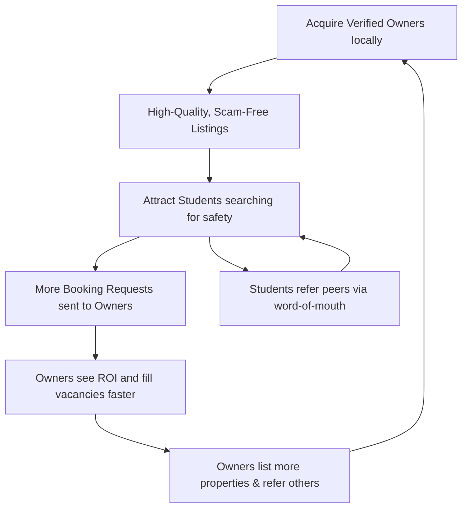

# 000 — Product Strategy: Sakank

## 1. Executive Summary

Sakank is a purpose-built, mobile-first marketplace designed to solve a localized, highly painful problem: university student accommodation in Egypt. While generic classifieds and social media groups offer fragmented, high-risk solutions, Sakank creates a trusted, verified ecosystem connecting students with property owners. By focusing relentlessly on safety, transparency, and the specific needs of the academic calendar, Sakank aims to monopolize the student housing niche before expanding into adjacent student services. This document outlines the strategic rationale, market opportunity, and go-to-market approach required to achieve Product-Market Fit (PMF) and secure a dominant market position.

## 2. Why Now?

Launching Sakank today capitalizes on several intersecting market dynamics:

- **Digital Behavior of Students:** The current university cohort (Gen Z) expects mobile-native, instantly gratifying, and transparent digital experiences. They are entirely smartphone-dependent.
- **Facebook Limitations:** Facebook Groups, the current market substitute, are deteriorating in UX. They lack structured data, geolocation, advanced filtering, and most importantly, identity verification.
- **Housing Demand & Decentralization:** Egypt is experiencing a boom in both private and national universities outside central Cairo (e.g., New Capital, Galala, New Mansoura, Badr City). This forces more students to relocate, driving a surge in localized housing demand.
- **Market Maturity:** E-commerce and digital marketplaces (like Swvl, Instabug, and local proptechs) have normalized digital transactions and trust in Egypt. However, the _student_ niche remains wholly underserved by generic platforms.

## 3. Market Opportunity

To size the market, we use a conservative, targeted approach for Egypt.

- **TAM (Total Addressable Market):**
  - _Assumption:_ ~3.5 million university students in Egypt. ~30% are out-of-town/expatriate students needing housing.
  - _Calculation:_ 1.05 million students needing accommodation annually.
- **SAM (Serviceable Available Market):**
  - _Assumption:_ Students in major decentralized university hubs (e.g., 6th of October, New Cairo, Badr City, Assiut, Mansoura) with higher smartphone penetration and higher willingness to bypass traditional brokers.
  - _Calculation:_ ~400,000 students.
- **SOM (Serviceable Obtainable Market):**
  - _Assumption:_ Capturing 5% of the SAM in the first 12–18 months through hyper-local university-by-university GTM.
  - _Calculation:_ 20,000 active students securing housing through Sakank.

## 4. Customer Segments

### Demand Side (The Students)

- **Out-of-Town Freshmen:** High anxiety, high need for safety and parental approval.
- **Returning Students:** Looking to upgrade from dorms or bad previous experiences.
- **International Students:** Lack local context, highly vulnerable to scams, willing to pay a premium for verified safety.

### Supply Side (The Owners)

- **Mom-and-Pop Landlords:** Own 1-3 apartments near a campus. Need reliable tenants but lack marketing reach.
- **Private Dorm Operators:** Small-to-medium institutional operators needing a consistent pipeline of students to maintain 100% occupancy.

### Internal Users

- **Operations & Trust Team:** Responsible for verifying listings, handling disputes, and onboarding initial supply.

### Future Partners

- **Universities:** Student affairs departments looking for safe off-campus housing recommendations.

## 5. Core Problems

_Ranked by severity and frequency._

| Rank  | Problem                                                                                 | Frequency | Severity                           | Existing Alternatives                         |
| :---- | :-------------------------------------------------------------------------------------- | :-------- | :--------------------------------- | :-------------------------------------------- |
| **1** | **Rampant Fraud & Scams** (Fake listings, hidden fees, bait-and-switch)                 | High      | Critical (Financial & Safety Risk) | Facebook Groups, OLX (Both unverified)        |
| **2** | **Predatory Brokerage (Samsara)** (Charging up to 1 month's rent for zero value-add)    | High      | High (Financial Drain)             | Traditional offline brokers                   |
| **3** | **High Search Friction** (Weeks of calling, visiting, and negotiating)                  | High      | Medium (Time Loss)                 | Word-of-mouth, physically walking the streets |
| **4** | **Supply-Side Vacancy** (Owners struggling to find students before the semester starts) | Medium    | High (Revenue Loss)                | Hanging banners on buildings                  |

## 6. Competitive Landscape

| Competitor              | Core Focus          | Verification                | UX for Students                  | Pricing Model        | Sakank's Edge                                           |
| :---------------------- | :------------------ | :-------------------------- | :------------------------------- | :------------------- | :------------------------------------------------------ |
| **Facebook Groups**     | Community/Chatter   | None (High Scam Risk)       | Poor (Unstructured)              | Free                 | Structured data, verified listings, map search.         |
| **OLX / Dubizzle**      | Generic Classifieds | Low (Phone only)            | Medium (Not student-specific)    | Freemium/Ads         | Hyper-targeted to students, no irrelevant listings.     |
| **Airbnb/Booking**      | Short-term/Tourists | High                        | High                             | High (Transactional) | Focus on academic terms (3-12 months), student budgets. |
| **Traditional Brokers** | Offline Matchmaking | Medium (Local knowledge)    | Poor (High pressure)             | 1 Month Rent         | Direct connection, zero/low cost, transparent.          |
| **Sakank**              | **Student Housing** | **Strict (Admin Approval)** | **Excellent (Tailored Filters)** | **Free (MVP)**       | **Niche monopoly, trust by default.**                   |

## 7. Unique Selling Proposition (USP)

**Sakank wins through Trust and Niche Focus.**
Generic platforms fail because a student's needs are entirely different from a family buying a home or a tourist booking a weekend stay. Sakank is the _only_ platform where every listing is verified, every user is a student, and the entire UX is built around the academic calendar and campus proximity. We are replacing anxiety with predictability.

## 8. Product Positioning

"For **university students who need accommodation**,
Sakank is **a verified, mobile-first marketplace**
Unlike **Facebook Groups**, **we guarantee structured, scam-free listings with exact geographic data.**
Unlike **Airbnb**, **we are optimized for long-term, affordable academic rentals.**
Unlike **Brokers**, **we connect you directly to the owner, saving you exorbitant commission fees.**"

## 9. Strategic Principles

1. **Trust before Growth:** Do not scale supply at the cost of verification. One scam damages the brand more than 100 empty listings.
2. **Density over Geography:** 1,000 listings around one university is infinitely more valuable than 1,000 listings spread across Egypt.
3. **Student First:** Every UI decision, filter, and policy must bias toward the student's safety and convenience.
4. **Fast Time-to-Value:** A student must be able to view a verified room near their faculty within 30 seconds of opening the app.
5. **Simple before Smart:** No AI recommendations or complex matching algorithms in V1. Focus on robust manual search and filters.

## 10. Product Flywheel

The growth engine relies on hyper-local liquidity.

## 11. Go-To-Market Strategy

A "Boiling the Ocean" approach will fail. We will use a hyper-local, phased rollout.

- **Phase 1: Single University (The Beachhead):** Target one dense, localized campus (e.g., Badr University or AUC New Cairo). Manually onboard 50-100 local property owners. Run targeted offline marketing (flyers, campus ambassadors) to students of that specific university. Achieve liquidity here first.
- **Phase 2: Nearby Universities (The Cluster):** Expand to adjacent universities in the same geographic zone (e.g., the rest of New Cairo or 6th of October). Leverage the existing supply base.
- **Phase 3: City Expansion:** Expand to major regional hubs (e.g., Mansoura, Assiut, Alexandria) using the exact playbook refined in Phase 1 & 2.
- **Phase 4: Nationwide & Institutional:** Establish official partnerships with universities to become their recommended off-campus housing portal.

## 12. Monetization Philosophy

**Do not monetize the MVP.**

- _Why?_ The initial goal is establishing liquidity and behavioral change. Introducing friction (fees) too early will drive users back to Facebook Groups.
- _When to Monetize?_ Only after Sakank has established a regional monopoly and high dependency from property owners (when owners realize Sakank brings them 80% of their tenants).
- _Future Revenue Streams:_
  1. **Freemium Supply Side:** Owners list for free, but pay for "Featured" placement or to unlock more than 3 active listings.
  2. **Lead Generation Fee:** Owners pay a small flat fee to unlock a student's contact information (cheaper than a broker's commission).
  3. **Value-Added Services (B2C):** Moving services, cleaning, furniture rental.

## 13. Risks

| Rank  | Risk Type       | Description                                                                                                | Mitigation                                                                                                                                      |
| :---- | :-------------- | :--------------------------------------------------------------------------------------------------------- | :---------------------------------------------------------------------------------------------------------------------------------------------- |
| **1** | **Operational** | **Verification Bottleneck:** Manual approval of listings scales poorly and slows down supply acquisition.  | Build internal admin tools for rapid review; eventually transition to trusted/verified owner badges allowing auto-publish for vetted landlords. |
| **2** | **Market**      | **Disintermediation:** Users find each other on Sakank but transact offline to avoid future platform fees. | Accept this for MVP (lead gen model). Future lock-in requires providing value _during_ the tenancy (e.g., easy rent payment, maintenance).      |
| **3** | **Business**    | **Extreme Seasonality:** 80% of traffic occurs in August/September.                                        | Maintain low fixed costs. Introduce summer housing for internships, and target international students with different academic calendars.        |
| **4** | **Regulatory**  | **Proptech / Brokerage Laws:** Egyptian law may require real estate brokerage licenses.                    | Position Sakank legally as a digital advertising/classifieds platform, not a real estate broker. Do not handle lease contracts in V1.           |

## 14. Success Definition (Product-Market Fit Signals)

Sakank has reached PMF when:

1. **Organic Supply Growth:** Owners are referring other owners, and supply acquisition shifts from outbound sales to inbound signups.
2. **High Conversion:** >20% of Weekly Active Users (WAU) are initiating a Booking Request.
3. **Retention of Supply:** Owners return to the app the following academic year to relist their properties.
4. **Word-of-Mouth Coefficient:** >50% of new student sign-ups cite "friend/classmate" as their acquisition source.

## 15. Product Evolution

- **Year 1 (The Matchmaker):** Hyper-local focus. Lead generation, manual verification, and establishing trust. No transactions.
- **Year 2 (The Facilitator):** Introduction of premium listings, digital identity verification integrations (Nafath/Government ID equivalents), and expansion to top 5 student cities.
- **Year 3 (The Transaction Engine):** Implementation of digital rent payments, escrow for deposits, and legally binding digital contracts.
- **Year 5 (The Ecosystem):** Roommate matching, university API integrations, student loans/rent financing, and a marketplace for student-specific services.

## 16. Things Sakank Will Never Become

- **Not a Hotel Platform:** We will not cater to weekend stays or tourists.
- **Not a General Classifieds Site:** You cannot buy a car or a TV on Sakank.
- **Not a Property Management ERP:** We are not building accounting software for massive real estate developers. We connect supply and demand.
- **Not a Social Network:** We facilitate transactions and housing, not status updates or news feeds.

## 17. Final Strategic Recommendation

**Before writing a single line of code:**

1. **Validate the Supply Side Manually:** Go to the chosen "Beachhead" university area. Speak to 20 property owners. Validate if they are willing to provide photos, exact prices, and adhere to a verification process in exchange for direct access to students. If they refuse, the digital model fails.
2. **Build a Concierge MVP (No-Code):** Prove the demand by capturing student leads via a simple landing page or Typeform and manually matching them with owners via WhatsApp. If students don't trust you to do it manually, they won't trust an app.
3. **Adopt a "Hard-Side" First Strategy:** Focus 80% of initial resources on acquiring high-quality supply. In real estate marketplaces, demand always follows high-quality, exclusive supply.
