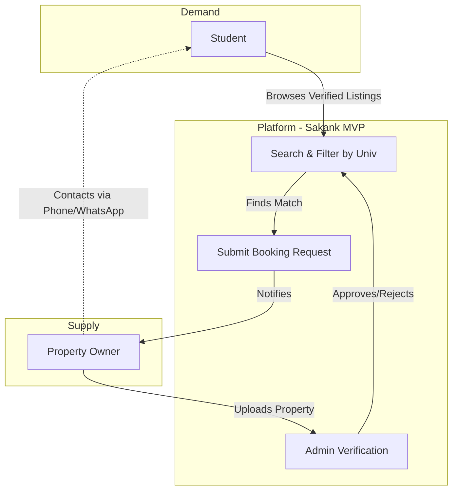

# 001 Product Vision: Sakank

## 1. Executive Summary

Sakank is a mobile-first marketplace built exclusively to solve the university student accommodation crisis in Egypt. By connecting students with verified property owners, Sakank replaces a fragmented, untrustworthy ecosystem (dominated by Facebook groups and predatory brokers) with a streamlined, transparent, and verified platform. Designed for a fast Minimum Viable Product (MVP) launch, the platform focuses on core discovery, lead generation, and initial booking requests, laying a scalable foundation for future transaction-based features.

## 2. Vision Statement

To become the ultimate, most trusted student living ecosystem in the MENA region, ensuring every university student has access to safe, affordable, and high-quality housing.

## 3. Mission Statement

To organize the student housing market in Egypt by providing a verified, mobile-first platform that connects students with reputable property owners, eliminating friction, fraud, and unnecessary middleman fees from the accommodation search process.

## 4. Problem Statement

The current student accommodation search in Egypt is deeply flawed, relying on informal networks and offline brokers. Real-world pain points include:

- **High Friction & Discovery Issues:** Students waste weeks scrolling disorganized Facebook groups (e.g., "Sakan Madinaty", "Sakan 6th of October") with no standard format, search filters, or map views.
- **Rampant Scams & Lack of Trust:** Listings often misrepresent the property (fake photos, hidden fees), and female students particularly struggle to find safe, verified housing.
- **Predatory Broker Fees (Samsara):** Middlemen often charge an entire month's rent just for introducing a student to a landlord.
- **Supply-Side Frustration:** Landlords struggle with high vacancy rates, unverified tenants, and the inability to reliably reach out-of-town students before the academic year starts.

## 5. Proposed Solution

Sakank is a targeted, mobile-first platform strictly for student housing.

- **Centralized Discovery:** Students can filter by university proximity, budget, and accommodation type (dorms, shared rooms, private rooms, full apartments).
- **Mandatory Verification:** All listings are reviewed and approved by Sakank admins before going live, guaranteeing authenticity.
- **Direct Connection:** Students can directly send a "Booking Request" to the property owner, eliminating predatory brokers and streamlining the initial handshake.

## 6. Target Audience

| User Type                  | Description                                                           | Key Needs                                                                                 |
| :------------------------- | :-------------------------------------------------------------------- | :---------------------------------------------------------------------------------------- |
| **Primary Users (Demand)** | University students (local and international) relocating for studies. | Safety, affordability, proximity to campus, zero/low broker fees, verified listings.      |
| **Primary Users (Supply)** | Independent property owners and private dorm operators.               | Consistent tenant pipeline, verified students, reduced vacancy periods.                   |
| **Internal Users**         | Sakank Operations & Admin Team.                                       | Efficient tools to review, approve, or reject property listings and manage user disputes. |

## 7. Value Proposition

| Competitor / Alternative  | Their Weaknesses                                                                         | Sakank's Value Proposition                                                                      |
| :------------------------ | :--------------------------------------------------------------------------------------- | :---------------------------------------------------------------------------------------------- |
| **Facebook Groups / OLX** | Unverified, high scam rate, no map search, poor filtering, expired listings.             | **100% Verified:** Structured data, map-based search, strict quality control.                   |
| **Traditional Brokers**   | High commissions (up to 1 month's rent), limited localized inventory, pressure tactics.  | **Direct & Transparent:** Connects students directly with owners; clear pricing upfront.        |
| **Airbnb / Booking.com**  | Expensive, tailored for short-term vacationers, not optimized for student budgets/needs. | **Student-Exclusive:** Built for academic terms, long-term stays, and student-specific filters. |

## 8. Product Principles

1. **Trust First:** Verification is mandatory. A smaller pool of high-quality, verified listings is better than thousands of unverified ones.
2. **Student-Centric:** UX/UI and filters must reflect student priorities (e.g., "Distance to Cairo University", "Female-only sharing").
3. **Simplicity over Features:** The MVP focuses on the core matchmaking loop. No complex features until the core loop is proven.
4. **Transparency:** All costs, rules, and property conditions must be visible before a booking request is made.
5. **Mobile-First:** 95%+ of the target demographic will access the platform via mobile devices.

## 9. MVP Scope (Version 1)

To ensure rapid time-to-market, V1 is focused strictly on discovery and lead generation.

### Student App (Demand)

- **Authentication:** Sign up/Login (Phone number OTP or Email).
- **Search & Discovery:** Search by university, location, or budget.
- **Filters:** Accommodation type (Room, Apartment, Dorm), gender preference, price range, amenities.
- **Property Details:** Photos, description, rules, distance to universities, pricing.
- **Favorites:** Ability to save properties for later.
- **Booking Request:** Submit a request to the owner indicating interest (triggers a notification to the owner).

### Property Owner App/Portal (Supply)

- **Authentication:** Sign up/Login.
- **Add Property:** Upload photos, set pricing, define rules, select amenities, set location.
- **Manage Listings:** Edit details, toggle visibility (Available/Rented).
- **View Booking Requests:** See interested students and their contact info to finalize the deal offline.

### Admin Dashboard (Internal)

- **Listing Moderation:** Review, approve, or reject new properties.
- **User Management:** View, suspend, or ban students/owners.
- **Basic Analytics:** Track total users, active listings, and booking requests.

## 10. Out of Scope (For MVP)

The following features are explicitly excluded from V1 to accelerate launch:

- **Online Payments:** All rent and deposit transactions happen offline between owner and student.
- **In-App Chat:** Users will connect via phone/WhatsApp after a booking request is accepted.
- **AI Recommendations:** Manual search and filters will suffice initially.
- **Roommate Matching:** MVP focuses on finding the _place_, not the _person_.
- **Maintenance Requests:** Property management is handled offline.
- **Subscription Plans / Monetization:** MVP focuses on user acquisition and liquidity; monetization infrastructure comes later.

## 11. Success Metrics (Months 1–6)

- **Supply Liquidity:** 500+ verified properties listed and approved pre-launch.
- **Demand Activation:** 5,000+ registered student users in the first 3 months.
- **Conversion Rate (Search to Request):** 15% of active users submit at least one booking request.
- **Listing Quality:** < 5% of properties reported for inaccuracies by students.

## 12. Risks & Assumptions

| Risk / Assumption                                                                                          | Impact | Mitigation Strategy                                                                                                                           |
| :--------------------------------------------------------------------------------------------------------- | :----- | :-------------------------------------------------------------------------------------------------------------------------------------------- |
| **Assumption:** Owners are willing to use a digital platform instead of relying solely on offline brokers. | High   | Offer initial free listings; provide hands-on onboarding support for the first 100 owners.                                                    |
| **Risk:** Supply side creates "fake" listings to lure students (Bait & Switch).                            | High   | Strict manual approval process by Admin; implement a fast user-reporting mechanism.                                                           |
| **Risk:** Students and owners bypass the platform once they have contact info.                             | Medium | Acceptable for MVP (lead gen model). Future versions will monetize via premium listings or platform-exclusive benefits, not transaction fees. |

## 13. Future Vision

Once the MVP proves product-market fit, Sakank will evolve into a comprehensive ecosystem:

- **Digital Payments & Escrow:** Secure rent collection and deposit protection.
- **Verified Digital Contracts:** Legally binding digital lease agreements.
- **Roommate Matching:** Tinder-style matching for compatible roommates based on habits and schedules.
- **University Partnerships:** Official housing partner for private and public universities.
- **Student Services Marketplace:** Moving services, furniture rental, and cleaning services.

---

## 14. High-Level Concept Diagram

