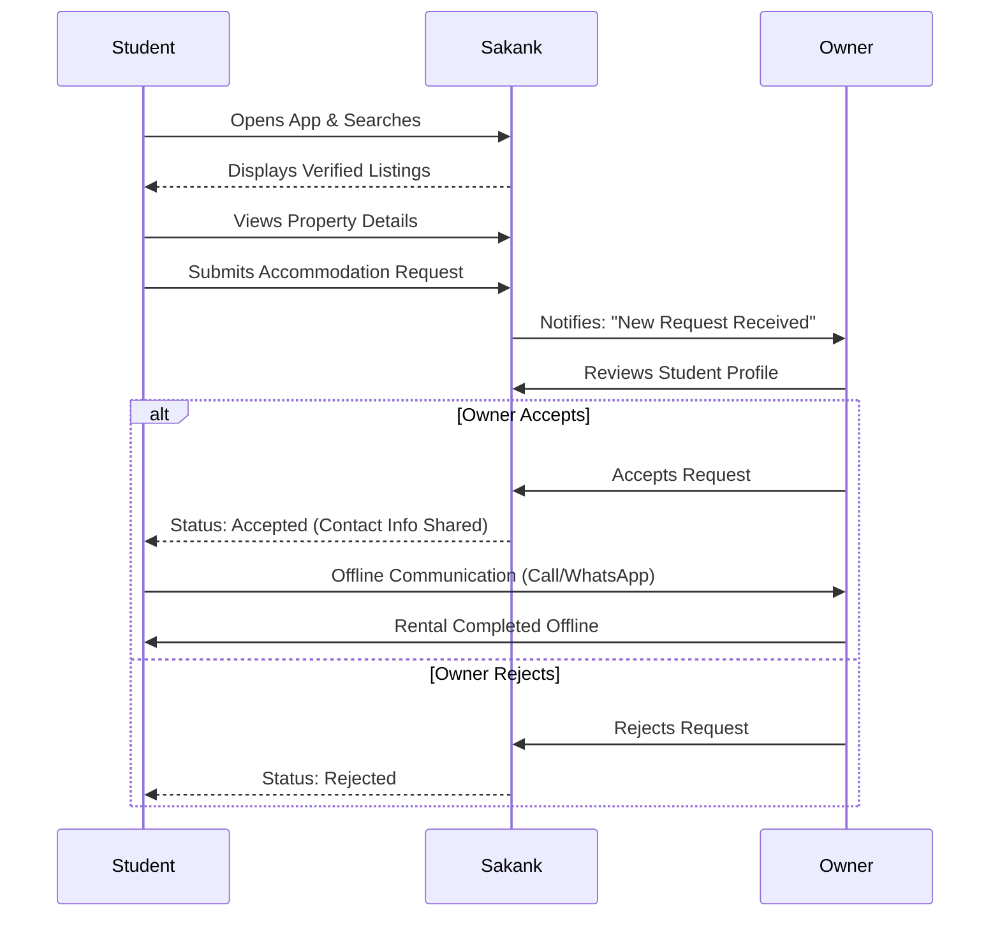

# 002 — Business Model: Sakank

## 1. Executive Summary

This document defines the foundational business model for Sakank. As a mobile-first student accommodation marketplace in Egypt, Sakank operates in its MVP phase strictly as a **Two-Sided Lead Generation Platform**. We connect verified demand (students) with verified supply (property owners, dorm operators). We deliberately decouple discovery from financial transactions for the MVP to minimize regulatory risk and accelerate time-to-market. Our core business objective is to achieve hyper-local liquidity—building dense, trusted supply around specific universities before expanding. This document serves as the business blueprint that directly influences our Domain-Driven Design (DDD), database schema, and API architecture.

## 2. Business Type

**Sakank is a Two-Sided Lead Generation Platform.**
_Why?_ The MVP does not process rent payments, escrow deposits, or legally binding contracts. Instead, it digitizes and streamlines the matchmaking process. We provide the digital infrastructure for discovery, filtering, and initial handshakes (Accommodation Requests), but the actual transaction (contract signing and payment) occurs offline. This drastically reduces the legal, financial, and operational overhead required to launch.

## 3. Marketplace Structure

```mermaid
graph TD
    subgraph Demand Side
        S[Students]
    end

    subgraph Platform: Sakank
        Discovery[Discovery & Matching]
        Verification[Trust & Verification]
        LeadGen[Lead Generation Engine]
    end

    subgraph Supply Side
        O[Individual Owners]
        D[Private Dorms]
        M[Property Managers]
    end

    subgraph Future Partners
        U[Universities]
        Ser[Service Providers]
    end

    S -->|Browses & Requests| Platform
    Platform -->|Delivers Qualified Leads| Supply Side
    Supply Side -->|Provides Inventory| Platform
    U -.->|Endorses| Platform
    Ser -.->|Value Adds| Platform
```

## 4. Stakeholders

| Stakeholder         | Goals                                              | Responsibilities                                              | Pain Points                                               | Expected Value                                         |
| :------------------ | :------------------------------------------------- | :------------------------------------------------------------ | :-------------------------------------------------------- | :----------------------------------------------------- |
| **Students**        | Find safe, affordable housing near campus.         | Provide accurate profile data; honor viewing appointments.    | High broker fees, scams, lack of transparent information. | Verified listings, direct owner contact, zero fees.    |
| **Property Owners** | Minimize vacancy; find reliable tenants.           | Maintain accurate listing details; respond promptly.          | High turnover, late rent, marketing costs.                | Free pipeline of qualified student leads.              |
| **Private Dorms**   | Achieve 100% occupancy before the semester starts. | Provide high-quality media; manage bulk listings.             | Competition with informal housing, high marketing spend.  | Centralized channel to reach massive student audience. |
| **Admin Team**      | Ensure platform safety and liquidity.              | Verify properties; moderate disputes; onboard initial supply. | Manual verification bottlenecks.                          | Scalable operational tools.                            |

## 5. Customer Segments

1. **Students:** Both local (moving from different governorates) and international students (expats).
2. **Individual Property Owners:** "Mom-and-pop" landlords owning 1-5 properties near universities.
3. **Private Dorm Operators:** Businesses running dedicated student housing buildings.
4. **Property Managers:** Individuals or small agencies managing properties on behalf of absentee owners.
5. **Brokers (Optional/Restricted):** Permitted _only_ if they are authorized representatives with exclusive rights, and they must adhere to transparent fee structures.
6. **Admin Team:** Internal Sakank operations staff.
7. **Future University Partners:** Student affairs departments looking for safe off-campus housing solutions.

## 6. Core Value Exchange

| Participant           | Provides (To Platform)                                      | Receives (From Platform)                                           |
| :-------------------- | :---------------------------------------------------------- | :----------------------------------------------------------------- |
| **Student**           | Verified Profile Data, Accommodation Requests, App Usage    | Verified Listings, Direct Contact with Supply, Peace of Mind       |
| **Property Owner**    | Exclusive/Accurate Inventory, Property Data, Responsiveness | Pre-qualified Student Leads, Reduced Vacancy, Trust Infrastructure |
| **Platform (Sakank)** | Discovery Engine, Verification Process, Lead Routing        | Marketplace Growth, Data Assets, Future Monetization Base          |

## 7. Accommodation Request Lifecycle



## 8. Marketplace Rules (Business Rules)

_These rules must map directly to Domain Policies in the DDD._

1. **Verification Before Visibility:** A property listing must be explicitly approved by an Admin before it appears in public search results.
2. **Single Active Request per Property:** A student cannot submit duplicate requests for the same property simultaneously.
3. **Listing Pausing:** Owners can mark a listing as "Rented" or "Paused" to temporarily hide it from search without deleting the data.
4. **Request Cancellation:** Students can cancel a pending Accommodation Request before the owner accepts it.
5. **Historical Traceability:** Rejected, cancelled, and fulfilled requests are never hard-deleted; they remain in the user's history and platform analytics.

## 9. Trust Model

In a market plagued by scams, trust is Sakank’s primary product.

- **Verification:** Initial supply onboarding requires Admin validation (checking owner ID and property photos).
- **Reporting:** Students have a one-click "Report Listing" feature for bait-and-switch or fake photos.
- **Moderation:** Admins can suspend users or listings immediately upon receiving credible reports.
- **Quality Control:** Owners with poor response times or high rejection rates are algorithmically penalized in search rankings.

## 10. Revenue Strategy

**Important: We will NOT optimize for revenue during the MVP.**
_Why?_ Imposing fees on day one introduces severe friction. Our first objective is to break the behavioral habit of using Facebook Groups. We must become the default search tool for students and the default lead generator for owners.

**Future Monetization Possibilities (Post-PMF):**

1. **Featured Listings:** Owners pay to boost their property to the top of search results.
2. **Lead Packages:** Private dorm operators buy "lead credits" to unlock student contact details in bulk.
3. **Advertising:** Hyper-targeted ads from student-centric brands (e.g., Telecom providers, furniture rentals).
4. **Value-Added Services:** Taking a cut on cleaning, moving, or internet setup services.

## 11. Marketplace Liquidity Strategy

Liquidity is defined as the probability that a student finds a room and an owner finds a tenant within a specific timeframe.

- **Single University Focus:** We will launch focusing on a single, high-density university campus.
- **Supply Density First:** We will pre-load the platform with 50-100 verified listings around this specific campus _before_ inviting students.
- **Demand Density:** Marketing efforts (flyers, ambassadors) will be restricted to the target university to ensure matching efficiency.
- **Local Expansion:** Once liquidity is achieved at University A, we replicate the playbook for University B.

## 12. North Star Metric

**North Star Metric: Number of Accepted Accommodation Requests.**
_Why?_ This is the exact moment value is created for both sides. The student found a place they like, and the owner approved the lead.

**Supporting KPIs:**

- **Search-to-Request Conversion Rate:** Are students finding what they want?
- **Owner Response Time:** Are owners active on the platform?
- **Time-to-Match:** Average days from student signup to an accepted request.

## 13. Business Risks

| Risk Type       | Description                                               | Mitigation Strategy                                                                                 |
| :-------------- | :-------------------------------------------------------- | :-------------------------------------------------------------------------------------------------- |
| **Market**      | entrenched behavior (users sticking to Facebook/Brokers). | Offer a 10x better UX: Map-view, strict verification, zero broker fees for students.                |
| **Operational** | Admin bottleneck in verifying new properties manually.    | Build an efficient internal Admin dashboard; utilize bulk upload tools for dorm operators.          |
| **Business**    | Disintermediation (parties bypassing the platform).       | Acceptable in MVP. Long-term lock-in relies on software features (e.g., digital rent payment).      |
| **Legal**       | Operating as an unlicensed real estate broker.            | Position Sakank purely as an advertising/lead-gen tech platform. No contracts signed in-app for V1. |
| **Financial**   | High customer acquisition cost (CAC) for owners.          | Utilize grassroots marketing; offer free listings to early adopters to build initial supply.        |

## 14. Business Assumptions

| Rank  | Assumption                                                                                       | Validation Method                                                                              |
| :---- | :----------------------------------------------------------------------------------------------- | :--------------------------------------------------------------------------------------------- |
| **1** | Property owners are willing to upload their listings to a new app instead of just using brokers. | Manual concierge onboarding: Can we convince 50 owners in one area to sign up face-to-face?    |
| **2** | Students trust Sakank more than Facebook Groups.                                                 | Landing page test / Beta launch: Measure conversion rates and qualitative feedback.            |
| **3** | Owners will actively check the app to Accept/Reject requests.                                    | Monitor "Time to Response" metrics in the first month. Use SMS notifications to prompt owners. |

## 15. Business Constraints (MVP)

- **Time:** MVP must launch within a tight 3-4 month window before the next academic semester begins (peak season).
- **Budget:** Bootstrapped/Pre-seed. Lean engineering team.
- **Operations:** Small admin team means manual verification must be streamlined.
- **Technology:** No complex AI matching; reliance on standard relational queries and geolocation filters.
- **Legal:** No payment gateways or escrow services to avoid regulatory compliance delays.

## 16. Operational Model

- **Property Verification:** Admins review submitted listings daily. They cross-check ID and photos. High-risk listings trigger a phone call to the owner.
- **Support:** In-app ticketing or WhatsApp integration for user issues.
- **Reports & Disputes:** If a student reports a property (e.g., "Owner demanded broker fee"), the listing is temporarily paused while Admins investigate.

## 17. Business Evolution

- **Phase 1 (The Matchmaker - MVP):** Lead generation, discovery, manual verification. Free for all.
- **Phase 2 (The Monetized Directory):** Premium listings for owners, automated verification (integrating with local digital ID services if possible).
- **Phase 3 (The Transaction Layer):** In-app rent payments, deposit holding, digital lease signing.
- **Phase 4 (The Ecosystem):** Roommate matching, university API integrations, student services marketplace.

## 18. What Sakank Will Never Do

- **Will NOT own or master-lease properties:** We are an asset-light technology platform.
- **Will NOT become a hotel/short-term rental platform:** We focus strictly on academic terms (minimum 1-month stays, typically 9-12 months).
- **Will NOT manage rentals on behalf of owners:** We do not handle physical maintenance, plumbing, or key handovers.
- **Will NOT compete with property owners:** We will never list Sakank-branded housing that competes with our supply side.

## 19. Final Recommendation (CPO Directive)

**Strategic Recommendation Before Engineering Starts:**

1. **Hardcode the "Single University" constraint into our GTM, but not our Architecture:** The system must be built to support multiple cities and universities, but our launch operations and marketing must be brutally restricted to ONE campus. Do not build complex multi-city filters if we only have supply in one area.
2. **Prioritize the "Accommodation Request" State Machine:** The core of the backend DDD will be the lifecycle of a Request (Pending -> Accepted/Rejected -> Cancelled). This state machine must be rock-solid, auditable, and tied to robust push/SMS notifications, as this is where our North Star Metric lives.
3. **Admin Panel is a First-Class Citizen:** Do not treat the Admin dashboard as an afterthought. Because "Verification" is our main value proposition, the Admin approval flow must be highly efficient, otherwise, supply acquisition will stall.
