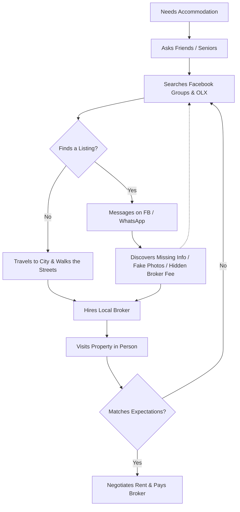

# 003 — User Research

## 1. Executive Summary

This foundational research document unpacks the psychological and behavioral realities of the student accommodation market in Egypt. The core finding is that the current market is entirely "zero-trust"—students fear scams, and owners fear unverified, irresponsible tenants. Consequently, both parties rely on highly inefficient, high-friction workarounds (like paying 1-month rent to a broker just to guarantee the property exists). Sakank’s primary opportunity is not merely digitizing listings, but digitizing _trust_. This document translates these behavioral realities into actionable product recommendations for the MVP, directly influencing our UX, UI, and Domain rules.

## 2. Research Goals

Before writing code, we must understand:

- The exact friction points in the offline/Facebook discovery process.
- The psychological drivers behind a student’s final housing decision (and their parents' influence).
- The operational bottlenecks for Property Owners.
- The specific visual and data signals that establish "Trust."

## 3. Research Questions

- How do students and parents currently navigate the search process?
- Why do students still pay exorbitant broker fees despite hating them?
- How long is the typical search cycle from intent to moving in?
- What specific information is almost always missing from Facebook/OLX listings?
- How do owners currently filter out "bad" leads?
- Who ultimately holds the decision-making power and the wallet (Student vs. Parent)?

## 4. Target Participants

For qualitative validation, the ecosystem involves:

- **Students:** Freshmen (first-time movers) and Seniors (experienced movers), Locals and Internationals.
- **Parents/Guardians:** Often the financial decision-makers, prioritizing safety above all.
- **Property Owners:** "Mom-and-pop" landlords managing 1-3 local apartments.
- **Private Dorm Operators:** Commercial entities managing 50+ beds.
- **Brokers:** Local neighborhood intermediaries (Samsara).
- **University Housing Offices (Future):** Internal university staff guiding students.

## 5. Student Journey Today

## 6. Owner Journey Today

_Assumption-based mapping, pending field validation._
Currently, an Owner with a vacant student apartment:

1. Takes poorly lit photos on their phone.
2. Posts in 5-10 local Facebook groups.
3. Gets flooded with unstructured Facebook comments ("How much?", "Where is it?").
4. Spends hours replying to unqualified leads (e.g., students who can't afford it, or want a room when the owner is renting the whole apartment).
5. Alternatively, the Owner gives the keys to a local Broker, accepting that the Broker will charge the student a high fee, which limits the pool of interested students.

- **Pain Points:** Wasted time on unqualified leads, high vacancy periods, lack of control over the Broker's narrative.

## 7. Pain Points

| Stakeholder | Pain Point                                                                               | Frequency | Severity | Business Impact                                 |
| :---------- | :--------------------------------------------------------------------------------------- | :-------- | :------- | :---------------------------------------------- |
| **Student** | **Scams / Fake Listings:** Photos don't match reality.                                   | High      | Critical | Loss of money/safety; total loss of trust.      |
| **Student** | **Predatory Broker Fees:** Paying 1 month rent for zero added value.                     | High      | High     | Financial drain; lowers budget for actual rent. |
| **Student** | **Missing Information:** Listings lack exact location, gender rules, or amenity details. | Very High | Medium   | Extreme search friction and wasted time.        |
| **Owner**   | **Unqualified Leads:** Answering calls from students with mismatched budgets/needs.      | High      | Medium   | Owner burnout; reliance on brokers.             |
| **Owner**   | **Vacancy:** Empty rooms during the academic year.                                       | Low       | Critical | Direct loss of revenue.                         |

## 8. User Motivations

What students (and their parents) truly care about:

1. **Safety (Primary for Female Students & Parents):** Secure neighborhood, trusted owner, clear house rules.
2. **Proximity & Transportation:** Walking distance to the university gates, or being on a direct, cheap microbus route.
3. **Price & Transparency:** Knowing the total cost upfront (Rent + Deposit + Utilities) with no hidden surprises.
4. **Internet (Crucial for Gen Z):** Is Wi-Fi included? Is it stable?
5. **Roommate Compatibility:** If sharing, who else is in the apartment? (Even if not solving this in MVP, the _question_ is a massive motivator).

## 9. Decision Factors

_Ranked in order of typical influence on the final Stay Request:_

1. **Location / Commute Time:** The absolute highest filter. If it takes >45 mins to reach campus, it is usually rejected.
2. **Budget constraint:** Hard ceiling set by parents.
3. **Gender Restrictions:** "Female Only" or "Male Only" buildings/apartments (Non-negotiable cultural factor).
4. **Visual Proof (Photos):** Cleanliness, especially of bathrooms and kitchens.
5. **Amenities:** Air conditioning, washing machine, stable internet.

## 10. Trust Signals

What makes a user trust a digital listing?

- **Platform Endorsement:** A "Verified Owner" badge issued by Sakank.
- **High-Quality, Comprehensive Photos:** Minimum 5 photos covering all rooms, bathroom, and kitchen.
- **Exact Map Location:** Not a vague neighborhood name, but a precise pin or distance tag ("500m from AUC Gate 4").
- **Completeness of Data:** A listing that details exactly what is included in the rent vs. what is extra.
- **Owner Responsiveness:** Fast reply times (to be tracked and displayed in future phases).

## 11. Current Alternatives

| Alternative                 | Advantages                                | Disadvantages                                                             | Why Users Still Use It                      |
| :-------------------------- | :---------------------------------------- | :------------------------------------------------------------------------ | :------------------------------------------ |
| **Facebook Groups**         | Massive audience, free to browse.         | Highly unstructured, high scam rate, outdated listings, no filters.       | "Everyone is there." The default habit.     |
| **Offline Brokers**         | Local knowledge, holds the physical keys. | Extremely expensive (Samsara), pushy, often hides property flaws.         | Guaranteed physical access to the property. |
| **OLX / Dubizzle**          | Has search filters, large inventory.      | Not student-specific, full of generic real estate, heavy broker presence. | Established brand for generic classifieds.  |
| **University Groups/Dorms** | 100% safe, close to campus.               | Limited capacity, strict curfews, low privacy.                            | Required by some parents for freshmen.      |

## 12. Opportunity Areas

Where Sakank can uniquely win:

1. **The Verification Monopoly (High Impact):** Be the only platform where every listing is manually checked.
2. **Student-Specific Filtering (High Impact):** Search by "Distance to University X" and "Accommodation Type" (Bed in double room vs. Private Apartment).
3. **Standardized Data (Medium Impact):** Forcing owners to fill out a structured form means students no longer have to ask "Does it have a washing machine?"

## 13. User Behaviors

_Observable Behavioral Patterns:_

- **The Parent Veto:** Students shortlist properties, but parents often make the final phone call/visit to approve and pay.
- **Late-Night Browsing:** Peak search activity happens between 10 PM and 2 AM.
- **The Seasonal Rush:** 80% of searches happen in a frantic 4-week window in August/September after university admissions are announced.
- **Comparison Hoarding:** Students "Favorite" or screenshot dozens of listings before initiating contact.
- **WhatsApp Default:** Even if an app has chat, users immediately try to move the conversation to WhatsApp.

## 14. User Segmentation (Behavioral)

Demographics matter less than behavior and urgency.

- **The Urgent Searcher:** "Semester starts in 3 days, I need a bed anywhere." (Prioritizes availability and speed over quality).
- **The Safety-First Parent:** "I am moving my daughter to Cairo for the first time." (Prioritizes Verified badges, proximity, and female-only dorms. Price is secondary).
- **The Budget Hunter:** "I just need a place to sleep, I'll commute 45 mins if it saves 500 EGP." (Relies heavily on price sorting).
- **The Group Finder:** A group of 3-4 friends looking to rent an entire apartment together. (Needs high-capacity units, whole apartments).

## 15. Research Insights (Summary)

| Observation                                      | Why It Happens                                                  | Product Implication (MVP)                                                                              |
| :----------------------------------------------- | :-------------------------------------------------------------- | :----------------------------------------------------------------------------------------------------- |
| Students hate broker fees but still use brokers. | Brokers control the local supply and keys.                      | Sakank must aggressively onboard Owners directly to bypass brokers.                                    |
| Parents often make the final decision.           | Parents hold the budget and prioritize safety.                  | Shareability is key. Students must easily share a web link of a Listing via WhatsApp to their parents. |
| Users abandon listings with only 1 photo.        | High suspicion of scams or hidden damage (e.g., bad bathrooms). | MVP Business Rule: Minimum 4 photos required for a listing to be Approved.                             |
| Users ask the same questions repeatedly.         | Facebook lacks structured data fields.                          | MVP UI: Must have explicit chips for "Wi-Fi", "AC", "Bills Included".                                  |

## 16. Product Recommendations

How this research directly shapes the product:

- **Search & Filters:** Must include "Distance to [Selected University]", "Gender Rule" (Male, Female, Mixed), and "Property Type" (Bed, Room, Apartment).
- **Listing Details:** Must clearly separate "Rent" from "Security Deposit" and explicitly state if utilities are included.
- **Stay Request Flow:** Must be asynchronous. A student sends a request, and it enters a "Pending" state. This sets the expectation that it is a _lead_, not a confirmed hotel booking.
- **Verification UI:** The "Verified" badge must be visually prominent (e.g., a green shield) on every listing card.
- **Sharing:** A native "Share to WhatsApp" button on the listing details page is critical for the "Parent Veto" behavior.

## 17. Research Gaps (Pending Validation)

_Assumptions we must validate before scaling:_

1. Will Owners check a mobile app daily to Accept/Reject Stay Requests, or do we need to build an SMS notification system to wake them up?
2. Are private dorm operators willing to manage inventory manually on an app, or do they require a web dashboard?
3. What is the exact maximum distance a student considers "near" campus? (e.g., 2km vs. 5km?)

## 18. Success Criteria

Sakank's UX is successful when:

1. Students stop asking "Is this available?" (Because Sakank handles availability status).
2. Students stop asking "Where exactly is this?" (Because of map integration).
3. Owners stop complaining about "Students who can't afford my place calling me." (Because prices are transparent).

## 19. Final Recommendations (Head of UX Research Directive)

**Action Items Before Engineering Begins:**

1. **The "Wizard of Oz" Test:** Do not build the Owner App yet. Build the Student App, acquire 50 real listings manually, and when a student hits "Submit Stay Request", the Sakank Admin team manually calls the Owner. Validate the demand side first.
2. **Force Structure, Accept Friction:** Owners will complain about having to upload 5 photos and fill out 10 fields. _Hold the line._ The entire value proposition of Sakank is structured, trusted data. If we allow "lazy" listings, we become Facebook.
3. **Design for WhatsApp:** Acknowledge that the final handshake happens on WhatsApp. Sakank's job is to deliver a highly qualified, deeply trusted lead to that WhatsApp conversation.
