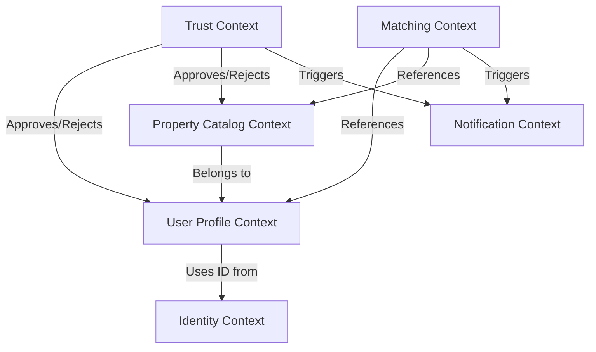
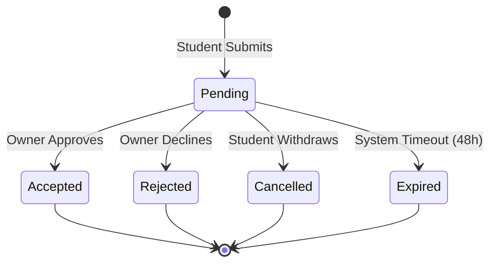
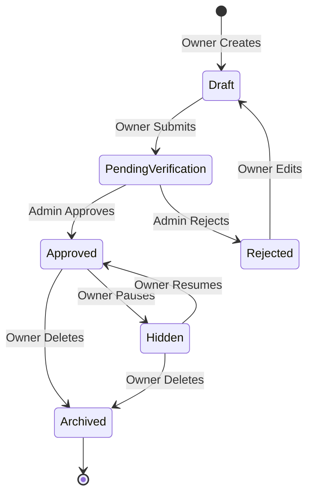

# 005 — Domain-Driven Design (DDD)

## 1. Executive Summary

This document establishes the strategic and tactical Domain-Driven Design (DDD) architecture for Sakank. As a lead-generation marketplace for student accommodation, our primary architectural challenge is decoupling the rapid, read-heavy nature of property discovery from the strict, write-heavy rules of verification and matchmaking. By defining clear Bounded Contexts, Aggregates, and Business Invariants, we ensure the system remains modular, scalable, and immune to the "Big Ball of Mud" anti-pattern. This document is purely behavioral—it defines _what_ the system does and _why_, serving as the blueprint for all future API and database designs.

## 2. Ubiquitous Language

The language used in this document strictly adheres to the `002.5 — Domain Glossary`. Terms like `Stay Request`, `Owner`, `Student`, and `Listing` have exact behavioral meanings. Engineering teams must enforce this language directly in the codebase (class names, variable names, module names) using the "Ctrl+F Rule". No synonyms are permitted.

## 3. Core Domain

**The Matching & Lead Generation Domain**

- _Why:_ Sakank's competitive advantage is not just listing properties (anyone can do that); it is successfully generating a high-intent, trusted connection between a Student and an Owner. The lifecycle of a `Stay Request` is the absolute core of the business and our North Star Metric. This domain dictates whether Sakank succeeds or fails.

## 4. Supporting Domains

1. **Property Catalog:** Manages the creation, definition, and visibility of `Properties`, `Units`, and `Listings`. It supports the core domain by providing the inventory necessary for matching.
2. **Trust & Verification:** Handles the moderation and approval of users and properties. Crucial for our "Trust First" principle, but it is a supporting capability, not the core matching engine.
3. **Engagement:** Manages user retention tools like `Favorites` and (future) `Reviews`.

## 5. Generic Domains

These are domains where Sakank should not reinvent the wheel. We will use off-the-shelf solutions or standard patterns:

- **Identity & Access Management (IAM):** Authentication, OTPs, role-based access. (e.g., Firebase Auth / Auth0).
- **Notifications:** Dispatching SMS, Email, and Push Notifications. (e.g., Twilio, FCM).
- **File Storage:** Storing and serving images. (e.g., AWS S3).
- **Search (Geospatial/Full-text):** Indexing listings for fast discovery. (e.g., Elasticsearch, Algolia, or PostGIS).
- **Analytics & Logging:** Tracking behavioral events and system health.

## 6. Bounded Contexts

### 6.1. Identity Context

- **Responsibilities:** Authentication, user registration, role assignment.
- **Owned Data:** Phone numbers, passwords, roles.
- **Business Rules:** Phone numbers must be unique and verified via OTP.

### 6.2. User Profile Context

- **Responsibilities:** Managing the business identity of `Student` and `Owner`.
- **Owned Data:** Names, university affiliations, profile pictures.
- **Outbound Dependencies:** Depends on Identity for Auth IDs.

### 6.3. Property Catalog Context

- **Responsibilities:** Managing physical real estate data and grouping it into public `Listings`.
- **Owned Data:** `Property`, `Unit`, `Listing`, `Amenity`.
- **Business Rules:** A `Property` must have at least one `Unit` to become a `Listing`.

### 6.4. Trust Context

- **Responsibilities:** Validating users and properties to ensure marketplace safety.
- **Owned Data:** `Verification` requests, Moderation logs.
- **Business Rules:** A `Listing` cannot be published until its `Verification` is Approved.

### 6.5. Matching Context

- **Responsibilities:** Handling the intent to rent.
- **Owned Data:** `Stay Request`.
- **Business Rules:** Prevents duplicate active requests; enforces Owner response SLAs.

### 6.6. Context Map (Mermaid)

## 7. Context Relationships

| Upstream Context     | Downstream Context   | Relationship Type                                               | Shared Concepts                      |
| :------------------- | :------------------- | :-------------------------------------------------------------- | :----------------------------------- |
| **Trust Context**    | **Property Catalog** | **Customer/Supplier:** Trust dictates visibility rules.         | `Listing ID`, `Verification Status`. |
| **Property Catalog** | **Matching Context** | **Conformist:** Matching cannot exist without Catalog's schema. | `Unit ID`, `Availability`.           |
| **User Profile**     | **Matching Context** | **Conformist:** Matching relies on Student/Owner IDs.           | `Student ID`, `Owner ID`.            |
| **Matching Context** | **Notification**     | **Published Language (Events):** Matching fires generic events. | `Event Payload`.                     |

## 8. Aggregates & Aggregate Roots

_We avoid large clusters. Aggregates must be small to prevent concurrency conflicts._

1. **`Student` (Root):** Holds demographic data, university affiliation.
2. **`Owner` (Root):** Holds owner contact data, verification status.
3. **`Property` (Root):** Represents a physical building/address. Contains `Unit` entities as children.
4. **`Listing` (Root):** The public-facing projection of a `Property` + `Unit` + Pricing.
5. **`Stay Request` (Root):** The transactional intent between a `Student` and a `Unit`.
6. **`Verification` (Root):** The admin workflow tracking the approval of a User or Property.

## 9. Aggregate Roots (Deep Dive)

### `Stay Request`

- **Responsibilities:** Manages the lifecycle of a student's intent to rent.
- **Invariants:** Cannot be created if the `Unit` is 'Occupied'. Cannot be 'Accepted' if it is already 'Cancelled'.
- **Lifecycle:** `Pending` -> `Accepted` | `Rejected` | `Cancelled` | `Expired`.

### `Property`

- **Responsibilities:** Manages the physical location and acts as a boundary for its `Units`.
- **Invariants:** Must have a valid geospatial location. Cannot be deleted if a child `Unit` has an active `Stay Request`.
- **Lifecycle:** Persistent until physically destroyed or permanently removed by Owner.

### `Listing`

- **Responsibilities:** Manages the public visibility and searchability of a `Unit`.
- **Invariants:** Must possess a minimum of 4 images. Cannot be `Approved` without an associated Approved `Verification`.
- **Lifecycle:** `Draft` -> `Pending` -> `Approved` <-> `Hidden`.

## 10. Entities (Inside Aggregates)

- **`Unit` (Entity inside `Property`):**
  - _Identity:_ Local ID within the Property.
  - _Responsibility:_ Holds specific pricing, capacity (beds), and availability.
- **`Image` (Entity inside `Listing`):**
  - _Identity:_ File URL/UUID.
  - _Responsibility:_ Visual representation, ordering (e.g., thumbnail vs gallery).

## 11. Value Objects

_Immutable objects without conceptual identity._

- **`Address`**: Street, Region, City. Two identical addresses are the same value.
- **`Coordinates`**: Latitude, Longitude.
- **`Money`**: Amount and Currency (always EGP for MVP).
- **`Distance`**: Calculated value from Property to University.
- **`GenderRestriction`**: Enum value (MaleOnly, FemaleOnly, Mixed).
- **`AmenityList`**: Collection of standard amenities.

## 12. Enumerations

- **`ListingStatus`**: Draft, PendingVerification, Approved, Rejected, Hidden, Archived.
- **`Availability`**: Available, Occupied, Unavailable.
- **`StayRequestStatus`**: Pending, Accepted, Rejected, Cancelled, Expired.
- **`VerificationStatus`**: Unverified, Pending, Verified, Rejected.
- **`UserRole`**: Student, Owner, Admin, Moderator.
- **`AccommodationType`**: EntireApartment, PrivateRoom, SharedRoom, DormBed.

## 13. Domain Services

_Stateless operations that span multiple aggregates._

- **`DistanceCalculationService`:** Calculates the distance between a `Property` Coordinates and a `University` Coordinates. Does not belong in `Property` or `University`.
- **`ListingPublishingService`:** Orchestrates the complex check of determining if a Listing _can_ go live (checks Owner Verification, Property Verification, and Image completeness).
- **`StayRequestExpirationService`:** A scheduled worker/service that transitions `Pending` requests to `Expired` if the Owner's SLA (e.g., 48 hours) is breached.

## 14. Domain Events

Events trigger asynchronous side-effects, keeping contexts decoupled.

| Event                  | Publisher        | Subscriber(s)                                                        |
| :--------------------- | :--------------- | :------------------------------------------------------------------- |
| `StudentRegistered`    | Identity Context | Notification (Send Welcome SMS)                                      |
| `PropertySubmitted`    | Catalog Context  | Trust Context (Create Verification Task)                             |
| `VerificationApproved` | Trust Context    | Catalog Context (Publish Listing)                                    |
| `StayRequestCreated`   | Matching Context | Notification (Alert Owner)                                           |
| `StayRequestAccepted`  | Matching Context | Notification (Alert Student, Share Contact Info)                     |
| `ListingHidden`        | Catalog Context  | Matching Context (Auto-reject pending requests? _Business decision_) |

## 15. Business Invariants

1. **The Lead Rule:** A `Stay Request` must reference exactly one `Student` and exactly one `Unit`.
2. **The Double-Booking Rule:** A `Student` cannot submit a duplicate active `Stay Request` for the exact same `Unit` if one is already `Pending`.
3. **The Trust Rule:** A `Listing` absolutely cannot transition to `Approved` status unless both the `Property` and the `Owner` hold a `Verified` status.
4. **The Privacy Rule:** Contact information (Phone Number) is strictly masked and cannot be shared across Bounded Contexts until a `StayRequestAccepted` event is fired.

## 16. State Machines (Mermaid)

### 16.1. Stay Request State Machine

### 16.2. Listing State Machine

## 17. Commands

| Command                 | Aggregate Target | Expected Outcome                                             |
| :---------------------- | :--------------- | :----------------------------------------------------------- |
| `CreateDraftListing`    | `Listing`        | Creates a new listing with `Draft` status.                   |
| `SubmitForVerification` | `Listing`        | Transitions Listing to `PendingVerification`, fires event.   |
| `ApproveVerification`   | `Verification`   | Marks verification complete, fires event to publish listing. |
| `SubmitStayRequest`     | `Stay Request`   | Creates `Pending` request, alerts Owner.                     |
| `AcceptStayRequest`     | `Stay Request`   | Transitions to `Accepted`, unlocks phone numbers.            |
| `CancelStayRequest`     | `Stay Request`   | Transitions to `Cancelled` (only if currently `Pending`).    |

## 18. Read Models (CQRS Perspective)

To ensure extreme performance on mobile, we separate write schemas from read models (at least conceptually).

- **Search Results (Catalog):** A highly denormalized read model containing `Listing ID`, `Price`, `Coordinates`, `Thumbnail`, and `Distance`. Optimized for fast geospatial querying.
- **Student Home Feed:** Tailored read model based on the Student's University ID.
- **Owner Request Dashboard:** An aggregated view combining `Stay Request` status with basic `Student` profile info.

## 19. Consistency Boundaries

- **Strong Consistency (Transactional):** Required within a single Aggregate. E.g., Changing a `Stay Request` from Pending to Accepted. Modifying a `Unit`'s price.
- **Eventual Consistency:** Acceptable across Bounded Contexts. E.g., When an Admin approves a `Verification`, it is acceptable for the `Listing` to become visible in the Search Index a few seconds later. When a `Stay Request` is accepted, the push notification can be sent eventually.

## 20. Transaction Boundaries

Transactions must NEVER span across multiple Aggregates synchronously.

- _Bad:_ A single database transaction updates the `Stay Request` status AND updates the `Owner`'s response rate stat.
- _Good:_ Transaction 1 updates the `Stay Request`. An event is fired. Transaction 2 (asynchronous) updates the `Owner`'s response rate stat based on the event.

## 21. Authorization Matrix

| Action                   | Student | Owner          | Admin | Moderator |
| :----------------------- | :------ | :------------- | :---- | :-------- |
| Browse Approved Listings | YES     | YES            | YES   | YES       |
| Submit Stay Request      | YES     | NO             | NO    | NO        |
| Accept/Reject Request    | NO      | YES (Own only) | NO    | NO        |
| Publish Listing          | NO      | NO             | YES   | NO        |
| Suspend User             | NO      | NO             | YES   | YES       |

## 22. Domain Risks

1. **Risk:** Treating `Property` and `Listing` as the same Aggregate.
   - _Impact:_ An owner with a 50-bed dorm would have to create 50 separate properties, duplicating address data and confusing the map UI.
   - _Mitigation:_ Explicitly separating `Property` (Location/Building) from `Unit` (Rentable space), and projecting them together as a public `Listing`.
2. **Risk:** Synchronous API calls for Notifications.
   - _Impact:_ If the SMS provider is down, the Student cannot submit a Stay Request.
   - _Mitigation:_ Notifications must be purely event-driven and handled asynchronously.

## 23. Future Extension Points

- **Payments & Escrow:** Will exist in a new, isolated `Finance Context`. It will listen to `StayRequestAccepted` events to trigger payment workflows.
- **Contracts:** A new `Legal Context` will generate PDFs based on data in the `Matching Context`.
- **Chat:** A `Messaging Context` will only allow connections if a `StayRequestAccepted` event exists between two users.

## 24. Final Architecture Recommendations (Chief Architect Directive)

**Before coding begins, the engineering team must commit to:**

1. **Event-Driven Mindset:** Do not tightly couple the Admin verification panel to the public Search catalog. Use Domain Events (`VerificationApproved`) to sync states.
2. **Aggregate Purity:** An API endpoint should ideally mutate only ONE Aggregate Root per request. If you find an endpoint modifying three different tables across domains, the transaction boundary is wrong.
3. **No Database-Driven Design:** Do not start by drawing SQL tables. Start by defining the aggregates (`Stay Request`, `Listing`) in code (domain models). The persistence layer (ORM/SQL) must be an implementation detail adapted to the domain, not the other way around.
