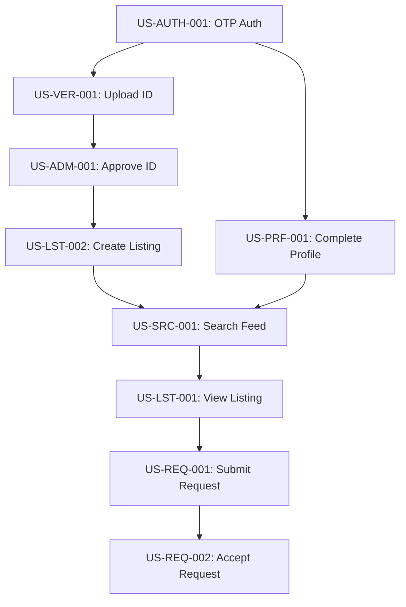

# 009 — User Stories

## 1. Executive Summary

This document translates the functional and non-functional requirements into an actionable agile backlog. Every User Story here is vertically sliced, meaning it delivers end-to-end business value (Frontend, Backend, and Database). This backlog acts as the daily execution manual for the development and QA teams, strictly adhering to the DDD models and Business Rules defined in earlier documents.

## 2. Definition of Ready (DoR)

A story cannot enter a Sprint unless:

- It has a unique ID and clear Priority.
- It is estimated in Fibonacci Story Points (1, 2, 3, 5, 8).
- Gherkin Acceptance Criteria are written and approved by QA.
- UI/UX designs are attached (if applicable).
- It explicitly references Domain Aggregates and Business Rules.

## 3. Definition of Done (DoD)

A story is not complete until:

- Code is merged to the main branch via Pull Request with minimum 1 approval.
- 100% of Gherkin Acceptance Criteria pass automated or manual QA.
- Backend logic enforces the linked Business Rules independently of the UI.
- No PII (like phone numbers) is leaked in API responses unless explicitly authorized.

---

## 4. Epics & User Stories

### EPIC: Authentication & Onboarding

#### US-AUTH-001: OTP Registration

**Feature:** Identity Verification | **Priority:** P0 | **Story Points:** 5 | **Dependencies:** None
**Actor:** Any User
**Story:** As a new user, I want to register using my phone number and an OTP so that I can securely access the platform without remembering a password.
**Acceptance Criteria:**

- **Given** I enter a valid Egyptian mobile number
- **When** I request an OTP
- **Then** the system sends a 6-digit code via SMS
- **Given** I enter the correct OTP
- **When** I submit the code
- **Then** I am authenticated and a `Student` or `Owner` identity is established.
  **Traceability:** `FR-AUTH-001` | `BR-USR-001` | `DDD: Identity Context`

#### US-PRF-001: Complete Student Profile

**Feature:** Profile Management | **Priority:** P0 | **Story Points:** 3 | **Dependencies:** US-AUTH-001
**Actor:** Safety-First Student
**Story:** As a Student, I want to select my University and Gender so that I can see relevant listings and submit requests.
**Acceptance Criteria:**

- **Given** I am newly registered
- **When** I navigate to the home screen
- **Then** I am forced to select a University and Gender before browsing.
  **Traceability:** `FR-AUTH-002` | `BR-USR-002` | `DDD: Student Aggregate`

---

### EPIC: Property Discovery

#### US-SRC-001: View Filtered Home Feed

**Feature:** Feed | **Priority:** P0 | **Story Points:** 5 | **Dependencies:** US-PRF-001, US-LST-002
**Actor:** Budget Hunter
**Story:** As a Student, I want to see a feed of available listings near my university so that I can quickly find accommodation.
**Acceptance Criteria:**

- **Given** I have selected a University
- **When** I open the app
- **Then** I see a list of `Approved` and `Available` properties sorted by distance.
- **And** I can see the price, capacity, and thumbnail image.
  **Traceability:** `FR-SRC-001` | `BR-SRC-001` | `DDD: Property Catalog Context`

#### US-LST-001: View Listing Details securely

**Feature:** Listing Details | **Priority:** P0 | **Story Points:** 3 | **Dependencies:** US-SRC-001
**Actor:** Safety-First Student
**Story:** As a Student, I want to view the full details of a listing (photos, rules, pricing) without seeing the Owner's phone number, so that privacy is maintained.
**Acceptance Criteria:**

- **Given** I tap on a Listing card
- **When** the details load
- **Then** I see all amenities and minimum 4 photos.
- **And** the Owner's phone number is strictly masked or excluded from the API payload.
  **Traceability:** `FR-LST-001` | `BR-PRV-001` | `DDD: Listing Aggregate`

---

### EPIC: Core Domain (Stay Requests)

#### US-REQ-001: Submit Stay Request

**Feature:** Intent to Rent | **Priority:** P0 | **Story Points:** 8 | **Dependencies:** US-LST-001
**Actor:** Urgent Searcher
**Story:** As a Student, I want to submit a Stay Request for a specific unit so that the Owner knows I want to rent it.
**Acceptance Criteria:**

- **Given** I am viewing an `Available` Unit
- **When** I tap "Request to Stay" and confirm
- **Then** a `StayRequest` is created in the `Pending` state.
- **And** I cannot submit another request for this exact Unit (Error `ERR-REQ-001`).
  **Traceability:** `FR-REQ-001` | `BR-REQ-001`, `BR-REQ-002`, `BR-CON-001` | `DDD: Stay Request`

#### US-REQ-002: Owner Accepts Request

**Feature:** Matchmaking | **Priority:** P0 | **Story Points:** 5 | **Dependencies:** US-REQ-001
**Actor:** Individual Owner
**Story:** As an Owner, I want to accept a pending Stay Request so that I can contact the Student and finalize the deal offline.
**Acceptance Criteria:**

- **Given** I have a `Pending` request for my Unit
- **When** I tap "Accept"
- **Then** the request state changes to `Accepted`.
- **And** the API immediately reveals the Student's phone number to me.
- **And** the Student receives a notification with my phone number.
  **Traceability:** `FR-REQ-002` | `BR-REQ-003`, `BR-PRV-002`, `BR-PRV-003` | `DDD: Stay Request`

#### US-REQ-003: Auto-Expire Request

**Feature:** SLA Enforcement | **Priority:** P1 | **Story Points:** 3 | **Dependencies:** US-REQ-001
**Actor:** System
**Story:** As the System, I want to automatically expire pending requests after 48 hours so that Students aren't left waiting indefinitely.
**Acceptance Criteria:**

- **Given** a request has been `Pending` for > 48 hours
- **When** the cron job runs
- **Then** the request state changes to `Expired`.
  **Traceability:** `BR-REQ-005`, `BR-TIM-001` | `DDD: Matching Context`

---

### EPIC: Trust & Verification

#### US-VER-001: Upload Owner ID

**Feature:** Verification | **Priority:** P0 | **Story Points:** 5 | **Dependencies:** US-AUTH-001
**Actor:** Individual Owner
**Story:** As an Owner, I want to upload my National ID so that I can get verified and publish my listings.
**Acceptance Criteria:**

- **Given** I am logged in as an Owner
- **When** I upload an image of my ID
- **Then** a `Verification` task is created with status `Pending`.
  **Traceability:** `FR-VER-001` | `BR-VER-001`, `BR-OWN-001` | `DDD: Trust Context`

#### US-ADM-001: Approve Verification Task

**Feature:** Admin Moderation | **Priority:** P0 | **Story Points:** 3 | **Dependencies:** US-VER-001
**Actor:** Admin
**Story:** As an Admin, I want to approve an Owner's verification so that their listings can go live.
**Acceptance Criteria:**

- **Given** I am viewing a `Pending` Verification in the dashboard
- **When** I tap "Approve"
- **Then** the Owner's status becomes `Verified`.
- **And** any of their `PendingVerification` listings automatically transition to `Approved`.
  **Traceability:** `FR-ADM-001` | `BR-VER-003`, `BR-LST-002` | `DDD: Trust Context`

---

## 5. Sprint Prioritization

### Sprint 1: Identity & Inventory (The Foundation)

- **Goal:** Users can authenticate, and Owners can create properties.
- **Stories:** US-AUTH-001, US-PRF-001, US-VER-001, plus Listing Creation stories.
- **Why:** The matching context cannot exist without user identities and physical inventory.

### Sprint 2: Trust & Discovery (The Supply Side)

- **Goal:** Admins can verify owners, and Students can search listings.
- **Stories:** US-ADM-001, US-SRC-001, US-LST-001.
- **Why:** Establishes the core requirement of a trusted marketplace.

### Sprint 3: The Match (The Demand Side)

- **Goal:** Students can submit requests, and Owners can accept them.
- **Stories:** US-REQ-001, US-REQ-002.
- **Why:** This is the core business loop. PMF depends entirely on this sprint.

### Sprint 4: Polish & SLA (The MVP Launch)

- **Goal:** Timeouts, Favorites, WhatsApp sharing, and bug fixing.
- **Stories:** US-REQ-003, Favorites stories, Notification integrations.

---

## 6. Story Dependency Graph

---

## 7. Future Stories (Post-MVP)

The following epics are strictly locked out of Sprints 1-4:

- **Payments:** `As a Student, I want to pay the security deposit via Fawry.`
- **Contracts:** `As an Owner, I want to generate a PDF lease agreement.`
- **Chat:** `As a Student, I want to message the Owner in-app after acceptance.`
- **Roommate Matching:** `As a Student, I want to find roommates based on sleep habits.`

---

## 8. Final Recommendations (Product Owner Directive)

**The MVP "Do Not Postpone" List:**
If time runs short, you can cut "Favorites", you can cut "Push Notifications" (fallback to SMS), and you can cut "Advanced Filters".
**You can NEVER cut:**

1. **US-ADM-001 (Verification Approval):** Without manual verification, we are a scam platform.
2. **US-REQ-002 (Accept Request & Reveal Number):** This is the exact moment the product delivers value. The logic of hiding the number before acceptance, and revealing it after, must be flawless and tested immediately.
