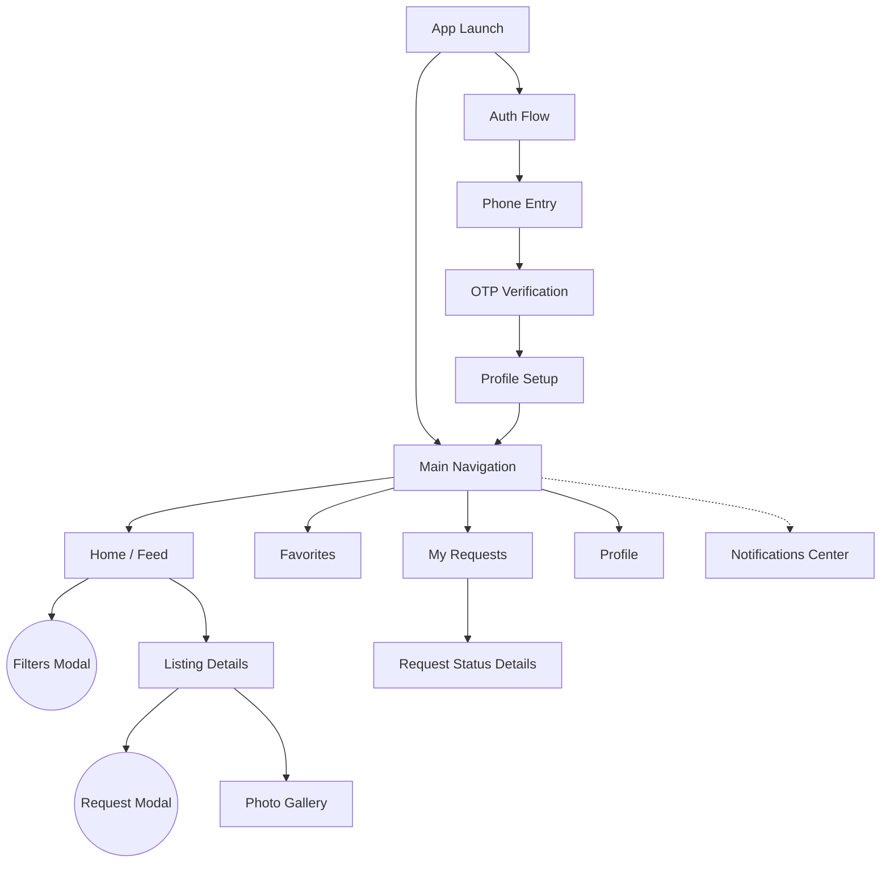

# 010 — Information Architecture (IA)

## 1. Executive Summary

Information Architecture (IA) is the structural blueprint of the Sakank application. Before a single pixel is designed in Figma or a single React Native component is built, we must define how information is organized, categorized, and navigated. This document ensures that the application is intuitive, minimizes cognitive load, and aligns perfectly with the previously established Business Rules and DDD aggregates. A solid IA guarantees that users can find what they need in fewer than 3 taps.

## 2. IA Principles

- **Simplicity:** The MVP focuses on a single core loop: Find a place -> Request it. Everything else is secondary.
- **Findability:** Critical filters (Gender, Price, Distance) must never be hidden inside deep menus.
- **Minimal Cognitive Load:** The UI must do the thinking. (e.g., Don't ask users to calculate commute times; show distance from their university).
- **Arabic-first Navigation:** Information flows right-to-left. Nomenclature must reflect colloquial Egyptian student terminology (e.g., "سكن طالبات").
- **Recognition over Recall:** Users shouldn't have to remember which properties they viewed; Recent Searches and Favorites handle this.

## 3. Global Navigation

The primary navigation pattern is a **Bottom Navigation Bar** for authenticated Students, ensuring the most frequent actions are accessible with one hand.

- **Tab 1:** Home / Search (الرئيسية)
- **Tab 2:** Favorites (المفضلات)
- **Tab 3:** Requests (طلباتي)
- **Tab 4:** Profile (حسابي)

_Note:_ Notifications are accessed via a bell icon in the top App Bar, as they represent transient state rather than a core destination. Authentication and Onboarding are full-screen, isolated flows without bottom navigation to prevent distraction.

## 4. Screen Inventory

| Screen ID       | Screen Name      | Purpose                    | Primary User    | Parent Screen      | Priority |
| :-------------- | :--------------- | :------------------------- | :-------------- | :----------------- | :------- |
| **SCR-AUTH-01** | Login (Phone)    | Capture phone number.      | Unauthenticated | None               | P0       |
| **SCR-AUTH-02** | OTP Verification | Validate identity.         | Unauthenticated | SCR-AUTH-01        | P0       |
| **SCR-PRF-01**  | Profile Setup    | Capture Name, Gender, Uni. | New Student     | SCR-AUTH-02        | P0       |
| **SCR-NAV-01**  | Home / Feed      | Browse local inventory.    | Student         | Root               | P0       |
| **SCR-SRC-01**  | Search Filters   | Refine listings.           | Student         | SCR-NAV-01 (Modal) | P0       |
| **SCR-LST-01**  | Listing Details  | Deep dive into a unit.     | Student         | SCR-NAV-01         | P0       |
| **SCR-REQ-01**  | Submit Request   | Confirm intent to rent.    | Student         | SCR-LST-01 (Modal) | P0       |
| **SCR-NAV-02**  | Favorites        | Saved properties.          | Student         | Root               | P1       |
| **SCR-NAV-03**  | My Requests      | Track request statuses.    | Student         | Root               | P0       |
| **SCR-NAV-04**  | Profile Settings | Manage account/privacy.    | Student         | Root               | P0       |
| **SCR-NOT-01**  | Notifications    | View alerts.               | Student         | Any Tab (Top Bar)  | P1       |

## 5. Navigation Tree (Mermaid)

## 6. Content & Information Hierarchy

### 6.1. Listing Details (SCR-LST-01)

- **Primary Information:** Image Gallery, Price (split by Rent/Utilities), Verification Badge, Availability Status.
- **Secondary Information:** Accommodation Type, Gender Restrictions, Capacity (Beds).
- **Supporting Information:** Description, Distance to University, Rules.
- **Actions:** Request to Stay (Primary Sticky Button), Favorite (Icon), Share to WhatsApp (Icon).

### 6.2. Home Feed Card

- **Primary Information:** Thumbnail Image, Price, Gender Badge (Male/Female/Mixed).
- **Secondary Information:** Unit Type (e.g., Shared Room), Distance.
- **Actions:** View Details (Card Tap), Quick Favorite (Heart Icon).

### 6.3. Request Status Details (SCR-REQ-01)

- **Primary Information:** Status (Pending/Accepted/Rejected), Listing Name.
- **Secondary Information:** SLA Timeout Countdown (e.g., "Expires in 24 hours").
- **Supporting Information:** Owner Phone Number (ONLY visible if Accepted).
- **Actions:** Cancel Request (if Pending), Call Owner (if Accepted).

## 7. Search Architecture

- **Default State:** Sort by "Distance to My University" ascending.
- **Filters (Modal):**
  1. Gender Restriction (Must match Student's gender by default).
  2. Max Price (Slider).
  3. Accommodation Type (Chips: Apartment, Private Room, Shared Room).
- **No Results:** Broaden search suggestion -> "No female-only rooms under 2000 EGP. Try increasing your budget."

## 8. Taxonomy (Classification System)

| Category          | Values                                                                                             |
| :---------------- | :------------------------------------------------------------------------------------------------- |
| **Property Type** | Building (عمارة), Villa (فيلا), Dorm (سكن طلابي)                                                   |
| **Unit Type**     | Entire Apartment (شقة كاملة), Private Room (غرفة سنجل), Shared Room (غرفة مشتركة), Dorm Bed (سرير) |
| **Gender Rules**  | Female Only (بنات فقط), Male Only (ولاد فقط), Mixed (مختلط)                                        |
| **Amenities**     | Wi-Fi (واي فاي), AC (تكييف), Elevator (أسانسير), Utilities Included (شامل الفواتير)                |

## 9. Labeling System (Arabic-First)

To maintain familiarity, we use terms Egyptian students actually use, mapping them cleanly to our DDD.

| English (DDD) | Arabic (UI Label) | Context       |
| :------------ | :---------------- | :------------ |
| Stay Request  | طلب سكن           | Action / Noun |
| Pending       | قيد الانتظار      | Status        |
| Accepted      | تم القبول         | Status        |
| Listing       | إعلان             | Noun          |
| Owner         | المالك            | Noun          |
| Verified      | موثق              | Badge         |
| Deposit       | تأمين             | Pricing       |
| Utilities     | فواتير            | Pricing       |

## 10. Navigation Rules

1. **Maximum Depth:** Users should never be more than 3 screens deep from the Bottom Navigation. (e.g., Home -> Listing -> Photo Gallery. Pressing 'Back' goes to Listing, then Home).
2. **Modals vs. Screens:** Transient actions (Filters, Confirm Request) must use bottom-sheet Modals. Exploratory actions (Listing Details) use full-screen transitions.
3. **Exit Points:** Every screen must have a clear "Back" (X or Arrow) action in the top leading corner.

## 11. Empty States

Empty states are critical opportunities for UX guidance.

- **No Favorites:** "لم تقم بحفظ أي إعلانات بعد. اضغط على علامة القلب لحفظ السكن المناسب لك." (You haven't saved any listings. Tap the heart to save.)
- **No Requests:** "ليس لديك طلبات سكن حالياً. ابحث عن سكنك الآن!" (No active requests. Start searching!)
- **No Notifications:** "لا توجد إشعارات جديدة." (No new notifications).

## 12. Error States

- **Permission Denied (Location):** "Sakank uses your university choice instead of GPS. Location access is optional."
- **Network Error:** "عفواً، لا يوجد اتصال بالإنترنت. يرجى المحاولة مرة أخرى." (No internet. Tap to retry.)
- **Request Expired:** Show a greyed-out card in My Requests with "انتهت صلاحية الطلب لعدم رد المالك" (Expired due to Owner inactivity).

## 13. Future IA Preparation

The IA is designed so the Bottom Navigation can scale.

- _Chat_ will be added as a top-bar icon next to Notifications.
- _Payments_ will be integrated as a modal flow initiated from the "My Requests" screen (after Acceptance).
- _Admin/Owner dashboards_ are structurally isolated from the Student App, eventually justifying a separate `Sakank Partner` app or a distinctly separate web portal.

## 14. IA Validation Checklist (For Designers)

Before creating high-fidelity UI, UX Designers must validate:

- [ ] **The "Thumb Zone" Test:** Are primary actions (Request, Filter, Navigate) reachable with one thumb on a 6.5" screen?
- [ ] **The "3-Tap" Rule:** Can a student find a listing and submit a request in <= 3 taps from the Home screen?
- [ ] **The Localization Test:** Does the layout accommodate Arabic text expansion without breaking components?

## 15. Final Recommendations (Head of UX Directive)

**The Non-Negotiable Directives:**

1. **Do not hide Filters:** In a student housing market, Price and Gender are not secondary choices; they are absolute constraints. Filters must be highly visible on the Home screen, not buried in a profile menu.
2. **Action Clarity over Aesthetics:** The "Request to Stay" button must be a sticky component at the bottom of the Listing Details screen. The user should never have to scroll back up to take action.
3. **Arabic-First Design:** Build and test all wireframes in Arabic first. English is the secondary UI language. RTL layout behavior dictates the architecture, not LTR.
