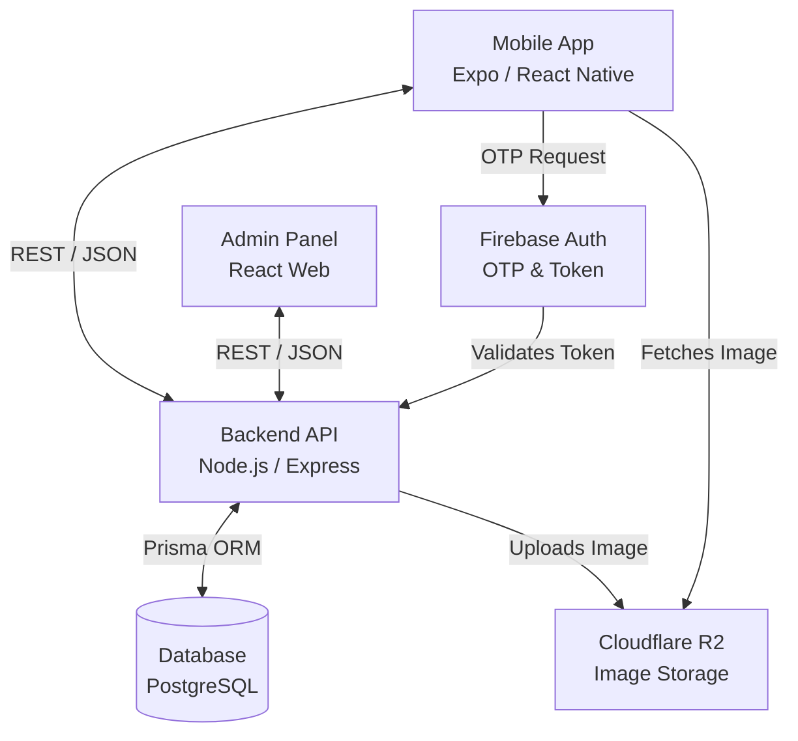

# 013 — Technical Architecture & Technology Stack

## 1. Executive Summary

This document serves as the definitive engineering blueprint for Sakank. The architectural philosophy is "Boring is Beautiful." We prioritize mature, battle-tested technologies over bleeding-edge trends to ensure stability, fast MVP delivery, and long-term scalability. By enforcing strict boundaries between the Mobile Client, API Layer, and Database, we prevent tight coupling. The chosen stack (React Native/Expo + Node/Express + Postgres/Prisma) allows a small, full-stack TypeScript team to move with maximum velocity while sharing types and validation logic across the entire boundary.

## 2. System Architecture

The system follows a classic decoupled Client-Server architecture, utilizing managed services to minimize DevOps overhead.



## 3. Project Structure (Monorepo via pnpm workspaces)

```text
sakank-monorepo/
├── apps/
│   ├── mobile/            # React Native Expo app
│   ├── api/               # Node.js Express server
│   └── admin/             # Future React Admin dashboard
├── packages/
│   ├── shared/            # Shared types, Zod schemas, constants
│   ├── ui/                # Shared UI components (if web is added)
│   ├── config/            # Shared ESLint, Prettier, TSConfig
│   └── docs/              # Architectural documentation (Markdown)
├── .github/
│   └── workflows/         # CI/CD pipelines
├── package.json
└── pnpm-workspace.yaml
```

## 4. Mobile Architecture (React Native & Expo)

- **Framework:** Expo SDK (Managed Workflow) for over-the-air (OTA) updates and zero native build headaches.
- **Routing:** Expo Router (File-based routing) for deep-link readiness and web-like navigation mental models.
- **Folder Structure:** Feature-first architecture (`/features/listings`, `/features/auth`). Each feature contains its own components, hooks, and API calls.
- **State Management:**
  - _Server State:_ TanStack Query (React Query) handles fetching, caching, background synchronization, and infinite scrolling.
  - _Client State:_ Zustand for global UI state (e.g., active filters, theme).
- **Lists:** `@shopify/flash-list` is mandatory for the Home Feed and Search Results to ensure 60fps scrolling and minimal memory footprint.
- **Images:** `expo-image` is mandatory for fast caching, WebP support, and memory management.
- **Forms & Validation:** `react-hook-form` paired with `@hookform/resolvers/zod` utilizing schemas imported from the `shared` package.
- **Animations:** `react-native-reanimated` for smooth, native-thread UI transitions (max 250ms).
- **Icons:** `Hugeicons` (Rounded variant) for a premium, consistent visual identity.

## 5. Backend Architecture (Node.js & Express)

- **Framework:** Express.js written in strict TypeScript.
- **Folder Structure (Domain-Driven):**
  - `/src/modules/stay-requests` (Contains controller, service, repository)
  - `/src/shared` (Middlewares, utils)
- **Layered Architecture:**
  - _Controllers:_ Handle HTTP req/res, parse inputs, call services.
  - _Services:_ Contain pure business logic (DDD rules). Ignorant of HTTP.
  - _Repositories:_ Handle all database queries (Prisma). Services never call Prisma directly.
- **Validation:** Zod schemas validate incoming `req.body` and `req.query` via middleware.
- **Background Jobs:** Simple in-memory queues (or Redis via BullMQ if scaled) for sending notifications and timing out expired stay requests.

## 6. Database Layer (PostgreSQL & Prisma)

- **Responsibilities:** Single source of truth for business data. Enforces referential integrity.
- **ORM:** Prisma ensures end-to-end type safety and rapid schema migrations.
- **Transactions:** Handled via Prisma's `$transaction` API. Mandatory for multi-step operations (e.g., Accepting a request and updating listing stats).
- **Connection Management:** Connection pooling handled at the infrastructure layer (e.g., PgBouncer) or via Prisma Accelerate if needed.

## 7. API Layer Philosophy

- **Style:** Strictly RESTful. Nouns for resources (`GET /listings`), verbs only for specific actions (`POST /stay-requests/:id/accept`).
- **Error Responses:** Standardized format across all endpoints:
  ```json
  { "error": true, "code": "ERR_REQ_001", "message": "Duplicate request", "details": [] }
  ```
- **Versioning:** API paths must include versioning (`/api/v1/listings`) from day one to support older mobile app versions.
- **Pagination:** Cursor-based pagination for feeds to prevent duplicate items during live updates.
- **Idempotency:** `POST` and `PUT` endpoints altering state must accept an `Idempotency-Key` header to prevent double charges/requests on poor networks.

## 8. Authentication Flow (Firebase Auth)

1. **Client:** Requests OTP via Firebase Auth SDK.
2. **Client:** Verifies OTP with Firebase, receives Firebase JWT.
3. **Client:** Sends Firebase JWT to Sakank API `/auth/login`.
4. **API:** Verifies Firebase JWT using Firebase Admin SDK.
5. **API:** Issues its own short-lived custom JWT (Access Token) and long-lived Refresh Token (HttpOnly Cookie for web, Secure Store for mobile).
6. **Session Expiration:** When Access Token expires, Client transparently calls `/auth/refresh` using the Refresh Token.

## 9. File Storage (Cloudflare R2)

- **Flow:** API generates a signed upload URL (Presigned URL) -> Mobile uploads image directly to R2 -> Mobile sends final R2 URL to API. (Prevents API bottleneck).
- **Optimization:** Cloudflare Polish/Image Resizing automatically serves compressed WebP/AVIF formats and thumbnails on the fly.
- **Naming Strategy:** UUIDs only (e.g., `images/listings/123e4567-e89b-12d3-a456-426614174000.webp`).

## 10. Security Architecture

- **Authorization:** Role-Based Access Control (RBAC). Admin APIs are isolated and protected by strict role checks.
- **Rate Limiting:** `express-rate-limit` applied globally (100 req/min), with stricter limits on `/auth` (5 req/min).
- **Data Protection:** Phone numbers are treated as PII. API responses omit phone numbers unless the requesting user has explicit authorization (e.g., Accepted Stay Request).
- **OWASP:** Helmet.js for secure HTTP headers. No sensitive secrets committed to Git.

## 11. Logging Strategy

- **Application Logs:** Request/Response timing, status codes (Winston or Pino).
- **Business Logs:** Domain events (e.g., `StayRequestCreated`, `OwnerVerified`).
- **Error Logs:** Stack traces captured and sent to an observability platform.
- **Audit Logs:** All Admin actions (approvals, rejections, bans) are permanently stored in an `AuditLog` database table.

## 12. Error Handling Strategy

- **Global Error Handler:** An Express middleware catches all unhandled exceptions to prevent server crashes and formats the response.
- **Validation Errors:** Zod errors are automatically mapped to HTTP 400 with exact field details.
- **Business Errors:** Custom `AppError` class throws specific HTTP codes (403, 404, 409) based on domain rule violations.

## 13. Performance Strategy

- **Caching:** Cloudflare CDN caches all static assets and public `GET /listings` responses (Edge caching).
- **Request Batching:** TanStack Query handles request deduplication on the client.
- **Database:** Proper indexing on `geography` columns, foreign keys, and frequently queried fields (`status`, `universityId`).

## 14. Offline Strategy

- **Cached Screens:** TanStack Query `persister` saves the Home Feed and My Requests to AsyncStorage. Users opening the app offline see stale data immediately.
- **Network Detection:** React Native NetInfo detects offline status and displays a persistent "Offline" banner.
- **Retry:** Mutations (e.g., submitting a request) are queued and retried automatically when the network returns.

## 15. Configuration Management

- **Environment Variables:** Strictly typed using T3 Env (Zod validation for `process.env`). Server will not boot if a required ENV is missing.
- **Secrets:** Stored in Railway's environment manager and GitHub Actions Secrets. Never hardcoded.

## 16. CI/CD Pipeline (GitHub Actions & Railway)

- **Branch Strategy:** Trunk-based development. Feature branches merge into `main`.
- **CI (Pull Requests):** Runs TypeScript type-checking, ESLint, Prettier, and Unit Tests. Fails PR if broken.
- **CD (Main):** Merging to `main` triggers automatic deployment to the Railway Staging environment.
- **Releases:** Tagging a release (`v1.0.0`) deploys to Railway Production and submits a new Expo build to App/Play Stores.

## 17. Monitoring & Observability

- **Crash Reporting:** Sentry (Mobile & Backend) for tracking fatal crashes and unhandled promises.
- **Performance:** Sentry tracing to identify slow API queries.
- **Health Checks:** `/api/health` endpoint monitored by Cloudflare.

## 18. Engineering Standards

- **Naming Conventions:** `camelCase` for variables, `PascalCase` for Components/Classes, `kebab-case` for file names.
- **Code Style:** Enforced automatically by Prettier and ESLint. No manual style debates in PRs.
- **Commit Messages:** Conventional Commits (`feat: add search`, `fix: auth crash`).
- **Git Strategy:** Rebase-and-merge only. Keep history linear.

## 19. Future Scalability Readiness

- **Horizontal Scaling:** The Node.js API is completely stateless (JWT auth, no in-memory sessions). It can scale infinitely by adding containers.
- **Event-Driven:** Business logic is decoupled into Domain Services, allowing an easy transition to a message broker (RabbitMQ/Kafka) when needed.
- **Web Client:** The monorepo structure and shared UI package mean a Next.js web client can be added effortlessly.

## 20. Risk Analysis

| Risk                          | Mitigation                                                                                        | Priority | Owner        |
| :---------------------------- | :------------------------------------------------------------------------------------------------ | :------- | :----------- |
| **Vendor Lock-in (Firebase)** | Only use Firebase for OTP. Immediately issue custom JWTs. Makes migrating auth providers trivial. | High     | Backend Lead |
| **Mobile App Size**           | Rely on Expo EAS builds and tree-shaking. Monitor bundle size closely.                            | Medium   | Mobile Lead  |
| **Image CDN Costs**           | Enforce aggressive compression (WebP) on client before R2 upload. Cap uploads to 5MB.             | High     | Backend Lead |

## 21. Final Recommendations (CTO Directive)

**What must never be changed without an Architecture Decision Record (ADR):**

1. **The Shared Types Monorepo:** The API and Mobile app MUST share the exact same Zod schemas and TypeScript interfaces. Duplicating types across repositories leads to silent API breaking changes.
2. **Prisma as the Single Source of Truth:** The database schema is the absolute foundation. No developer is allowed to bypass the ORM to run raw SQL mutations unless facing a critical, documented performance bottleneck.
3. **State Management Discipline:** Zustand is ONLY for global UI state (Theme, Auth Status). TanStack Query MUST be used for all API data. Mixing these responsibilities will create a caching nightmare.
