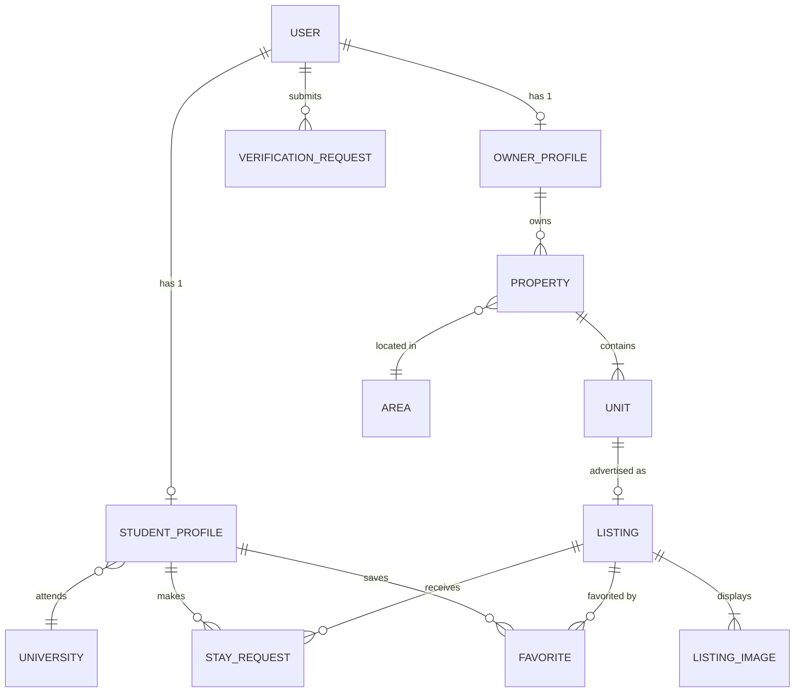

# 014 — Database Design

## 1. Executive Summary

This document defines the database architecture for Sakank. PostgreSQL was chosen for its strict ACID compliance, robust geospatial capabilities (PostGIS compatibility for future use), and proven scalability. The schema is designed through the lens of Domain-Driven Design (DDD), mapping directly to the Bounded Contexts defined in Document 005. By leveraging Prisma as our ORM, we ensure end-to-end type safety. This design enforces strict data integrity while utilizing Soft Deletes and Audit Fields to maintain a complete historical record of the system.

## 2. Naming Conventions

To ensure consistency across the database, Prisma schema, and TypeScript code, the following conventions are strictly enforced:

- **Table Naming:** Singular, PascalCase in Prisma (`StayRequest`), mapped to singular snake_case in PostgreSQL via `@map("stay_request")`.
- **Column Naming:** camelCase in Prisma (`createdAt`), mapped to snake_case in PostgreSQL via `@map("created_at")`.
- **Foreign Key Naming:** Appended with `Id` (e.g., `ownerId`).
- **Index Naming:** Prefix with `idx_` followed by table and column names (e.g., `idx_listing_status`).
- **Constraint Naming:** Prefix with `fk_`, `uq_`, or `chk_` (e.g., `uq_user_phone`).
- **Enum Naming:** PascalCase (e.g., `UserRole`), values in UPPER_SNAKE_CASE (e.g., `FEMALE_ONLY`).

## 3. Enumerations

| Enum Name            | Values                                                                        | Context            |
| :------------------- | :---------------------------------------------------------------------------- | :----------------- |
| `UserRole`           | `STUDENT`, `OWNER`, `ADMIN`, `MODERATOR`                                      | Identity           |
| `Gender`             | `MALE`, `FEMALE`                                                              | Identity / Profile |
| `ListingStatus`      | `DRAFT`, `PENDING_VERIFICATION`, `APPROVED`, `REJECTED`, `HIDDEN`, `ARCHIVED` | Catalog            |
| `VerificationStatus` | `UNVERIFIED`, `PENDING`, `VERIFIED`, `REJECTED`                               | Trust              |
| `StayRequestStatus`  | `PENDING`, `ACCEPTED`, `REJECTED`, `CANCELLED`, `EXPIRED`                     | Matching           |
| `PropertyType`       | `BUILDING`, `VILLA`, `DORMITORY`, `APARTMENT`                                 | Catalog            |
| `UnitType`           | `ENTIRE_APARTMENT`, `PRIVATE_ROOM`, `SHARED_ROOM`, `DORM_BED`                 | Catalog            |
| `GenderRestriction`  | `MALE_ONLY`, `FEMALE_ONLY`, `MIXED`                                           | Catalog            |
| `AvailabilityStatus` | `AVAILABLE`, `OCCUPIED`, `UNAVAILABLE`                                        | Catalog            |

## 4. Core Entities & Catalog

### Identity & Profile Context

- **User:**
  - _Purpose:_ Core authentication identity.
  - _PK:_ UUID.
  - _Lifecycle:_ Created on OTP verification.
- **StudentProfile / OwnerProfile:**
  - _Purpose:_ Domain-specific profile data.
  - _Relationships:_ 1:1 with User. `StudentProfile` belongs to `University`.

### Catalog Context

- **Property:**
  - _Purpose:_ The physical building/location.
  - _Relationships:_ Belongs to `User` (Owner), 1:M with `Unit`.
- **Unit:**
  - _Purpose:_ The rentable space (Room/Bed). Contains base pricing.
  - _Relationships:_ Belongs to `Property`.
- **Listing:**
  - _Purpose:_ The public advertisement of a `Unit`.
  - _Relationships:_ 1:1 with `Unit`. 1:M with `ListingImage`.
- **ListingImage / MediaFile:**
  - _Purpose:_ Stores R2 CDN URLs.

### Matching & Trust Context

- **StayRequest:**
  - _Purpose:_ Intent to rent.
  - _Relationships:_ Belongs to `StudentProfile` and `Listing`.
- **VerificationRequest:**
  - _Purpose:_ Admin approval workflow for Owners.
  - _Relationships:_ Belongs to `User` (Owner).

### Geography Context

- **University, Governorate, City, Area:**
  - _Purpose:_ Lookups for filtering and location hierarchies.

## 5. Relationships & ER Diagram (Mermaid)

### Cascade & Restrict Rules

- **Restrict:** A `Property` cannot be deleted if it has an associated `Unit`. A `Unit` cannot be deleted if it has historical `StayRequests`.
- **Cascade:** Deleting a `Listing` cascades deletion to `ListingImage` and `Favorite`, but NOT to `StayRequest`.

## 6. Value Objects (JSONB vs Columns)

- **Coordinates:** Modeled as `latitude` (Float) and `longitude` (Float) columns. Future migration will convert this to a PostGIS `geography` point.
- **Money:** Base rent modeled as `rentAmount` (Integer, storing EGP). Currency is implicitly EGP for MVP.
- **Amenities:** Modeled as a JSONB column on the `Listing` table (e.g., `["WIFI", "AC"]`) to avoid excessive join tables for simple boolean flags.

## 7. Audit Fields & Soft Delete Strategy

**Every single table** (except simple join tables) must include:

- `id`: UUID (Primary Key).
- `createdAt`: DateTime (Default `now()`).
- `updatedAt`: DateTime (Auto-updated on modification).
- `deletedAt`: DateTime (Nullable).
- `version`: Integer (Default 1, incremented on update for Optimistic Locking).

**Soft Delete Strategy:**
No row is ever physically `DELETE`d from the database. Instead, `deletedAt` is populated. Prisma queries must heavily utilize global middleware or explicit `where: { deletedAt: null }` filters. This ensures historical `StayRequests` never break if an owner "deletes" a property.

## 8. Constraints

- **Unique Constraint (`uq_user_phone`):** A phone number can only exist once across the `User` table.
- **Unique Constraint (`uq_active_request`):** A composite unique constraint on `(studentId, listingId)` where `status` IN (`PENDING`, `ACCEPTED`) prevents duplicate active requests (Business Rule BR-REQ-001).
- **Check Constraint:** `rentAmount > 0` and `capacity > 0`.

## 9. Index Strategy

- **Search Optimization:** B-Tree index on `Listing.status` and `Unit.availabilityStatus`.
- **Filtering:** Composite index on `Listing(status, genderRestriction, rentAmount)`.
- **Foreign Keys:** EVERY foreign key (e.g., `ownerId`, `universityId`) must have a dedicated index to prevent table scans during JOINs.
- **Cursor Pagination:** Index on `createdAt` (DESC) paired with `id` for fast infinite scrolling.

## 10. Transactions

Transactions (`$transaction` in Prisma) are strictly required for:

1. **Create Stay Request:** Validating `Unit` availability -> Creating `StayRequest` -> Creating `Notification`.
2. **Accept Stay Request:** Updating `StayRequest` status -> Automatically rejecting other pending requests for the same single-capacity Unit.
3. **Verification Approval:** Updating `VerificationRequest` -> Automatically updating associated `Listing` statuses to `APPROVED`.

## 11. Data Integrity Rules

- **Orphan Prevention:** A `Unit` must ALWAYS link to a `Property`.
- **Referential Integrity:** Enforced natively by PostgreSQL Foreign Keys, NOT just by Prisma application logic.
- **State Transitions:** While Prisma cannot enforce state machines natively, optimistic locking (`version` field) ensures concurrent API requests do not transition a `StayRequest` from `PENDING` to both `ACCEPTED` and `REJECTED` simultaneously.

## 12. Performance Strategy

- **N+1 Prevention:** Enforce deep nested includes only when explicitly needed. Use Prisma's `select` heavily over returning entire entity graphs.
- **Read-Heavy Optimization:** The `Listing` entity is highly denormalized intentionally (pulling `rentAmount` and `genderRestriction` from `Unit` into `Listing`) to allow sorting and filtering on a single table without massive JOINs during Search.

## 13. Prisma Mapping Considerations

- Do not use Prisma's implicit many-to-many relations for core business entities. Always create explicit join tables (e.g., `Favorite`) with UUIDs, `createdAt`, and `deletedAt`.
- Map Prisma enums directly to PostgreSQL native ENUMs to enforce data integrity at the database engine layer.

## 14. Migration Strategy

- **Development:** Developers permit `prisma migrate dev`.
- **Production:** Migrations are applied via CI/CD pipeline using `prisma migrate deploy` before the new API code boots.
- **Rollback:** Prisma does not natively support downward migrations. Rollbacks require manual SQL script execution. Therefore, additive migrations (adding columns) are preferred over destructive ones.
- **Seed Data:** A robust `seed.ts` script must populate `University`, `Governorate`, `City`, and `Area` tables in every environment.

## 15. Security Considerations

- **PII:** The `User.phoneNumber` must be considered highly sensitive.
- **Data Retention:** Soft-deleted data containing PII must be scrubbed by a background cron job after 30 days to comply with general data privacy best practices, converting the phone number to `[DELETED_UUID]`.

## 16. Backup & Recovery

- **Frequency:** Automated continuous backups (WAL archiving) enabling Point-In-Time-Recovery (PITR).
- **RPO/RTO:** Recovery Point Objective < 5 mins. Recovery Time Objective < 1 hour.
- **Execution:** Handled entirely by the managed PostgreSQL provider (e.g., Railway/Supabase).

## 17. Future Expansion (Reserved Philosophy)

The database is structured to avoid future migrations that break existing data:

- **Payments:** Will be introduced as an isolated `PaymentIntent` table linked to `StayRequest`.
- **Chat:** Will rely on a NoSQL store or a separate `Message` table grouped by `StayRequestId`.

## 18. Risk Analysis

| Risk                    | Impact | Likelihood | Mitigation                                                                                                                                             | Priority |
| :---------------------- | :----- | :--------- | :----------------------------------------------------------------------------------------------------------------------------------------------------- | :------- |
| Soft Delete Leakage     | High   | Medium     | Developers forgetting `deletedAt: null` in queries. Mitigated by Prisma Client Extensions (Global Middleware).                                         | Critical |
| Poor Geospatial Queries | High   | Medium     | Filtering by distance using Haversine formula in pure SQL is slow. Mitigate by keeping MVP radius calculations simple, and plan to migrate to PostGIS. | High     |

## 19. Final Recommendations (Principal Database Architect Directive)

**The Non-Negotiable Directives:**

1. **Never mutate Primary Keys:** Use UUID v4 for every single table. Never use auto-incrementing integers, as they expose database size, allow ID enumeration attacks (scraping), and make database merging/sharding impossible later.
2. **Enforce FKs at the Engine Level:** Prisma makes it easy to mock relations. Sakank MUST enforce all Foreign Key constraints natively in PostgreSQL. If the database engine doesn't reject it, it's not a real constraint.
3. **No Hard Deletes in Production:** If an Owner deletes their account, the application must soft-delete it. Hard deleting destroys the historical integrity of past Stay Requests and financial audits.
