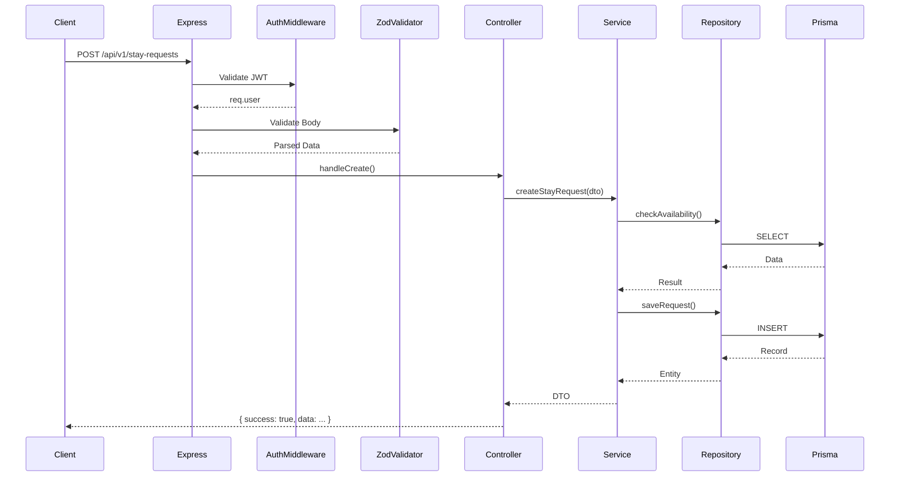

# 016 — Backend Implementation Guide

## 1. Executive Summary

This document is the official Backend Implementation Guide for Sakank. It is the definitive handbook for human engineers and AI assistants. Our backend philosophy is rooted in **predictability, strict boundaries, and domain isolation**. Frameworks will change, but a well-architected domain survives. By enforcing strict separation of concerns—where controllers know nothing of the database, and the database knows nothing of HTTP—we ensure the codebase remains scalable, testable, and maintainable. Consistency is not just a preference; it is a strict engineering requirement.

## 2. Architecture Principles

- **Domain First:** Business logic lives exclusively in Services. Not in controllers, not in middlewares, not in Prisma hooks.
- **Dependency Direction:** Dependencies point inwards toward the domain. Controllers depend on Services. Services depend on Repositories. Repositories depend on Prisma. The reverse is strictly forbidden.
- **Explicitness over Magic:** No implicit data loading. If you need relations, explicitly include them. Avoid decorators or metaprogramming that obfuscate execution flow.
- **Fail Fast:** Validate everything at the boundaries (HTTP input, DB output). Throw errors immediately rather than propagating bad state.
- **Never Trust Client Input:** Every `req.body`, `req.query`, and `req.params` must pass through a strict Zod schema before hitting a controller.
- **Stateless APIs:** The Node.js server maintains zero state. All session data lives in JWTs.

## 3. Folder Structure

The backend is structured by Feature Modules (DDD Bounded Contexts) rather than technical layers.

```text
src/
├── config/           # Environment variables, constants, third-party setup
├── lib/              # Wrapped external libraries (e.g., Firebase Auth, Sentry)
├── shared/           # Cross-module code
│   ├── middlewares/  # Global middlewares (Auth, ErrorHandler)
│   ├── errors/       # Custom AppError classes
│   ├── utils/        # Generic helpers
│   └── types/        # Global TypeScript types
├── modules/          # Feature domains
│   ├── auth/         # Authentication domain
│   ├── listings/     # Property catalog domain
│   ├── stay-requests/# Matching domain
│   └── users/        # Identity domain
├── jobs/             # Cron jobs and queue processors
├── events/           # Domain event definitions and listeners
├── scripts/          # Database seeding, migration runners
└── server.ts         # Application entry point
```

## 4. Module Structure

Inside each feature module (e.g., `src/modules/stay-requests/`), the structure is:

- `stay-request.routes.ts`: Maps HTTP endpoints to controller methods.
- `stay-request.controller.ts`: Extracts HTTP req data, calls service, returns unified HTTP res.
- `stay-request.service.ts`: Core business rules (BR-XXX). Enforces state machines.
- `stay-request.repository.ts`: Only layer allowed to import and query Prisma.
- `stay-request.validator.ts`: Zod schemas for the module.
- `stay-request.dto.ts`: Data Transfer Objects (Interfaces).
- `stay-request.mapper.ts`: Maps Prisma models to API output (hiding PII).

## 5. Request Lifecycle (Mermaid)



## 6. Dependency Rules

- **Controller** -> Imports Service, Validator, DTO. _Forbidden: Prisma, HTTP external libraries._
- **Service** -> Imports Repository, DTO, AppErrors, Events. _Forbidden: Express (`req`/`res`), Prisma._
- **Repository** -> Imports Prisma, DTO. _Forbidden: Express, other Repositories (avoid cyclic DB calls)._
- **No Circular Dependencies:** Use tools like `madge` in CI to fail builds if circular imports exist.

## 7. Validation Strategy

- **Tool:** Zod.
- **Environment:** `process.env` is strictly validated at boot using Zod (T3 Env pattern). The server crashes instantly if variables are missing.
- **HTTP Inputs:** Middleware validates `req.body`, `req.query`, and `req.params`. Invalid data returns `400 Bad Request` instantly.
- **Business Validation:** Occurs in the Service layer (e.g., "Is this student allowed to request a female-only unit?").

## 8. Error Handling

- **Base Error:** `AppError` extends built-in `Error`. Contains `httpStatus`, `errorCode`, and `isOperational`.
- **Global Error Middleware:** Captures all thrown errors. If it's an `AppError`, it formats the response. If it's an unknown error (e.g., DB crash), it logs to Sentry, hides the stack trace, and returns `500 Internal Server Error`.
- **Logging Rules:** Log `AppError` at `WARN` level. Log unknown errors at `ERROR` level.

## 9. Authentication & Authorization

- **Auth:** Firebase verifies the OTP. The API validates the Firebase token once, then issues a Sakank Custom JWT containing `userId` and `role`.
- **Authorization:** `requireRole(['ADMIN'])` middleware.
- **Ownership:** Ownership validation MUST occur in the Service layer. E.g., `if (listing.ownerId !== req.user.id) throw new ForbiddenError()`.

## 10. Repository Pattern

- **Responsibilities:** Isolates the Service from Prisma. If we switch ORMs, only the Repository changes.
- **Transactions:** Handled by passing Prisma's transaction client (`tx`) to repository methods.
- **Logic:** Absolutely NO business logic. Only `findMany`, `create`, `update`, `delete`.

## 11. Service Layer

- **Responsibilities:** The heart of the application. Enforces Sakank Business Rules (006).
- **Orchestration:** Calls multiple repositories. Wraps operations in transactions if multiple aggregates are affected.
- **Purity:** Services must never import `express` or know about HTTP status codes.

## 12. Controller Layer

- **Thin Controllers:** Controllers should be 10-20 lines max.
- **Mapping:** Extract `req.body` and `req.user.id`, call `service.doSomething()`, and wrap the result in `res.status(200).json({ success: true, ... })`.

## 13. Configuration & Logging

- **Configuration:** Managed via `.env`. Passed through a validated `config.ts` singleton.
- **Logging:** Use `Pino` or `Winston`. Every request must generate an `X-Correlation-ID` to track logs across services. Never log passwords, tokens, or phone numbers.

## 14. Background Jobs & Events

- **Jobs:** Use a lightweight runner (e.g., `node-cron` for MVP, `BullMQ` + Redis for scale) to process asynchronous tasks like expiring old Stay Requests.
- **Events:** Use Node's `EventEmitter` to decouple side effects. E.g., `StayRequestCreated` event triggers a listener that sends an SMS to the Owner, rather than blocking the main HTTP request.

## 15. File Uploads

- **Flow:** Controller generates an R2 Presigned URL. Mobile uploads the file directly to Cloudflare. Mobile sends the final URL back to the API.
- **Security:** API validates that the URL domain matches our Cloudflare bucket before saving it to the database.

## 16. Security Standards

- **Helmet:** Mandatory for secure HTTP headers.
- **Rate Limiting:** Mandatory on all routes, aggressive on `/auth`.
- **CORS:** Strict origin matching for the Admin panel. Mobile does not require CORS but API keys can be used for extra layer.
- **Sanitization:** All text input is stripped of HTML tags to prevent XSS.

## 17. Performance

- **Connection Pooling:** Use PgBouncer or Prisma Accelerate for Postgres connections.
- **N+1 Queries:** Monitored strictly. Use Prisma's `include` carefully. Do not loop over database queries in services; use `in` queries.

## 18. Testing Strategy

- **AAA Pattern:** Arrange, Act, Assert.
- **Unit Tests (Jest):** Services and Utils. Repositories are mocked.
- **Integration Tests (Supertest):** Controllers hitting a test Database (Testcontainers).
- **Coverage:** Minimum 80% coverage on Services (Domain Logic).

## 19. Git & Development Workflow

**Step-by-step feature creation:**

1. Define DTOs and Zod Schemas.
2. Create Repository (DB interaction).
3. Create Service (Business Logic) & Write Unit Tests.
4. Create Controller (HTTP Mapping).
5. Register Route in the Module Router.
6. Commit using `feat(stay-requests): add accept request endpoint`.

## 20. AI Coding Rules (Strict Directives for AI)

When generating backend code, AI assistants MUST:

- Never use `any`. Define precise TypeScript interfaces.
- Never skip Zod validation for HTTP inputs.
- Never write Prisma queries inside controllers or services.
- Never duplicate code. Extract to `shared/utils`.
- Always wrap HTTP responses in the `{ success, data, meta, error }` unified format.
- Always use the custom `AppError` classes instead of throwing raw strings.
- Never return `User.phoneNumber` from an endpoint unless explicitly required and authorized.

## 21. Final Recommendations (Backend Tech Lead)

**The Implementation Rules that MUST NEVER be violated:**

1. **The DB Leak Rule:** Never return a Prisma model directly from a Controller. Always pass it through a Mapper or pick specific fields. Returning raw DB rows leads to accidental PII leakage (like exposing phone numbers).
2. **The Isolation Rule:** If you import `express` inside a Service, the PR will be rejected. Services must be callable from a Cron Job, a CLI script, or an HTTP Controller equally.
3. **The Transaction Rule:** If an endpoint modifies more than one database table (e.g., Accepting a request AND updating listing status), it MUST be wrapped in a database transaction. Partial failures corrupt the domain state.
