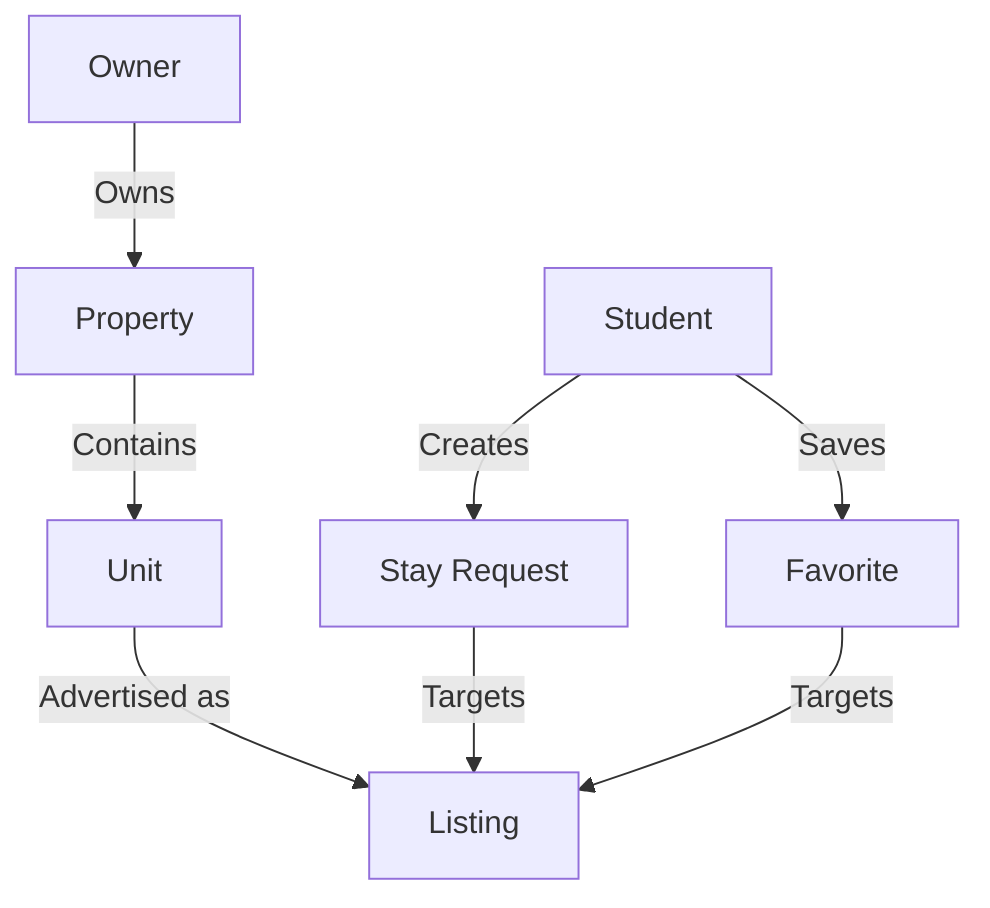

# System Overview

Sakank connects students looking for accommodation with property owners.

## Business Domains

### Identity (Users)
- **User:** The base identity, authenticated via Firebase Phone OTP.
- **Student Profile:** Contains academic details (University, Faculty, etc.).
- **Owner Profile:** Contains verified details of property owners.

### Geography
- **Governorate -> City -> Area:** Defines the location hierarchy.
- **University:** Independent entity for student association.

### Catalog (Properties & Units)
- **Property:** The physical building (e.g., Villa, Apartment Building).
- **Unit:** The rentable space within a property (e.g., Room, Bed, Studio).

### Marketplace (Listings & Matching)
- **Listing:** The active advertisement for a Unit.
- **StayRequest:** A student's application to rent a Listing.
- **Favorite:** Students saving Listings for later.

## Interactions

