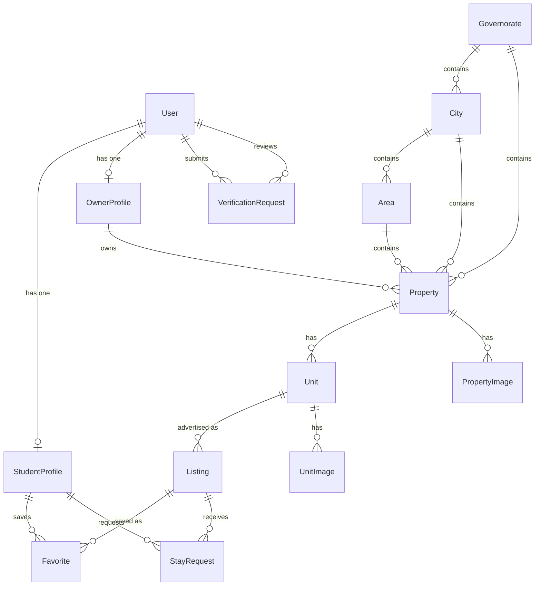

# Entity Relationship Diagram (ERD)

```mermaid
erDiagram
    User ||--o| StudentProfile : "has one"
    User ||--o| OwnerProfile : "has one"
    User ||--o{ VerificationRequest : "submits"
    User ||--o{ VerificationRequest : "reviews"

    Governorate ||--o{ City : "contains"
    City ||--o{ Area : "contains"

    Governorate ||--o{ Property : "contains"
    City ||--o{ Property : "contains"
    Area ||--o{ Property : "contains"

    OwnerProfile ||--o{ Property : "owns"
    
    Property ||--o{ Unit : "has"
    Property ||--o{ PropertyImage : "has"
    
    Unit ||--o{ Listing : "advertised as"
    Unit ||--o{ UnitImage : "has"

    Listing ||--o{ Favorite : "saved as"
    StudentProfile ||--o{ Favorite : "saves"

    Listing ||--o{ StayRequest : "receives"
    StudentProfile ||--o{ StayRequest : "requests"
```
